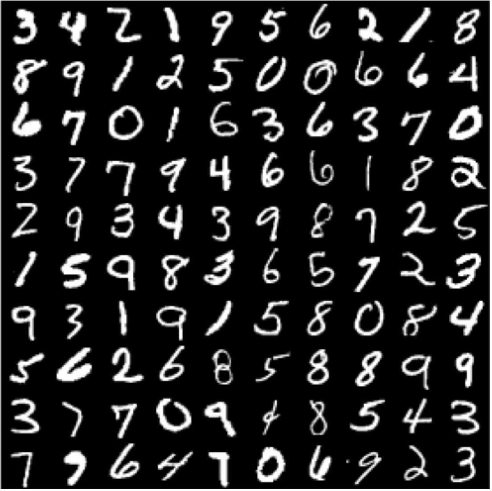
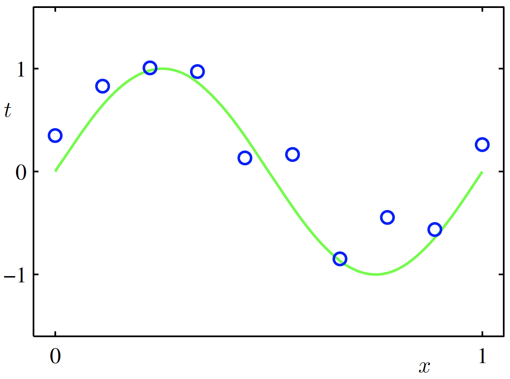
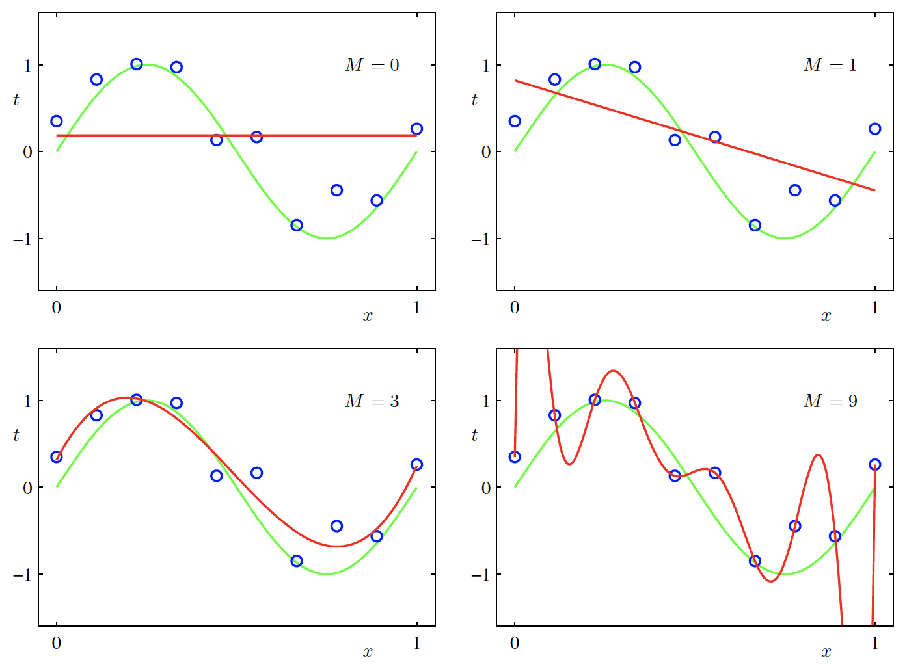
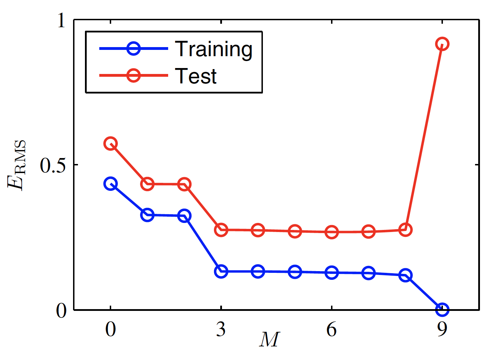
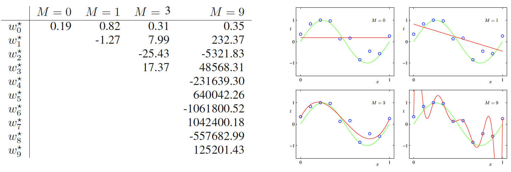

# Lecture 1: Introduction, Polynomial Curve Fitting, and Probability Theory - 13/01/20

## Notations

>   using Classifying Hand Written Digits as example

-   A training set of $N$ digits
-   Each digit, $i$, is an image, representing as an ***input vector of pixel values*** $\boldsymbol{x}_i$
-   The category of each digit, $i$, is known and expresses as ***target vector*** $\boldsymbol{t}_i$

-   ML algorithm outputs function $y(\boldsymbol{x})$, which can take new digit input $x$ and output vector $y$, which is a ***guess*** of the target $\boldsymbol{t}$. The precise form of $y(\boldsymbol{x})$ is determined during the training phases.
-   The ability to categorise new examples that differ from those used for training is called ***generalisation***

## Supervised Learning

>   Problems are ones where the data contains both input and corresponding target vectors.
>
>   -   ***Classification***
>   -   ***Regression***

The inputs may be ***pre-processed*** to reduce variability in the inputs.

## Unsupervised Learning

>   Problems are ones where the data contains only input vetors but no targets.
>
>   -   ***Clustering*** - discovering groups of similiar examples
>   -   ***Density Estimation*** - learning how data is distributed
>   -   ***Dimensionality Reduction*** - representing high dimensional data with just a few variables

## Reinforcement Learning

>   Problems are ones that interact with an environment by choosing actions and observing changes in state. Actions must act to maximise a ***reward signal***. Optimal actions are discovered by ***trials and errors***.

## Polynomial Curve Fitting

-   ***Training inputs*** $\boldsymbol{x} = (x_1, \dots, x_N)^T$ 
-   ***Training targets*** $\boldsymbol{t} = (t_1,\dots,t_N)^T$

>   This is ***synthetic data*** - we know how it originatged

-   Each $x_i$ is sampled uniformly from $[0,1]$
-   Each $t_i = sin(2\pi x_i) + (Gaussian \space Noise)$ 

>   Data tends to have an underlying regularity or structure obscured by noise. Noise can be:
>
>   -   ***intrinsically stochastic*** (random)
>   -   resulted of ***unobserved*** sources of ***variability***

### Aim

-   Predict a target $\hat{\boldsymbol{t}}$ for an unseen input $\hat{\boldsymbol{x}}$
-   Discover the ***underlying structure***
-   Sparate it from the ***noise***

### Fitting with Linear Model

$$
y(x,\boldsymbol{w}) = w_0 + w_1 x + w_2 x^2 + \dots + w_M x^M = \sum_{j=0}^{M}w_j x^j
$$

-   $M$ is the ***order of the polynomial***
-   ***Polynomial coefficients*** $w_0, \dots, w_M$ are collected into vector $\boldsymbol{w}$
-   $y(x,\boldsymbol{w})$ is non-linear in $x$, but it is linear in $\boldsymbol{w}$ and so we call this a ***linear model***

>   We estimate values for $\boldsymbol{w}$ by fitting the function to training data. Fit the function by ***minising*** an ***error function***

### Error Function

A widely used error function is the ***Sum of Square Errors***
$$
E(\boldsymbol{w}) = \frac{1}{2}\sum_{n= 1}^{N} [y(x_n,\boldsymbol{w}) - t_n]^2
$$

-   ***Best Fit*** $\boldsymbol{w}^* = \arg \min_\boldsymbol{w}E(\boldsymbol{w})$
-   ***Perfect Fit*** if $E(\boldsymbol{w}^*) = 0$

-   Bigger differences are increasingly ***penalised***

### Finding the Best Polynomial Degree

>   Choosing the best $M$ is an example of ***Model Selection***
>
>   -   Small values of $M$ give a poor fit
>   -   Large values of $M$ appear to ***over-fit*** - ***capture the noise*** rather than underlying structure

## Evaluating Fit and Regularisation

We need an objective way to test our fit

***Root Mean Squared Error (RMSE)***
$$
E_{RMS} = \sqrt{\frac{2}{N}E(\boldsymbol{w}^*)}
$$

>   Comparable for different amounts of data

## Avoiding Over-fitting

### Indirect Evidence of Over-fitting

-   Dramatic increse of $E_{RMS}$ of training set and the difference between the $E_{RMS}$ of training set and testing set  as degree gets larger
-   Magnitude of $\boldsymbol{w}_i^*$ is extremely large 

>   Over-fitting means we fail to ***generalise*** to un seen data

>   For $M = 9$, the magnitude of some $\boldsymbol{w}_i^*$ are very large, and the model makes some extreme predictions

***Dilemma***: Complex Models(more expressive) **v.** Over-fitting

### Solution 1: Use More Data

### Solution 2: Regularisation

Using a new ***error function*** that ***penalises*** extreme parameter values
$$
\tilde{E}(\boldsymbol{w}) = \frac{1}{2}\sum_{n=1}^{N}[y(x_n,\boldsymbol{w})-t_n]^2 + \frac{\lambda}{2}
$$
Where 
$$
|| \boldsymbol{w}||^2 = \boldsymbol{w}^T\boldsymbol{w} = w_0^2 + w_1^2 + \dots + w_M^2
$$
 Minimising error function
$$
\boldsymbol{w}^* = \arg\min_w \tilde{E}(\boldsymbol{w})
$$

Regularisation appears to control the effective complexity of the model,and hence the degree of overfitting.

## Probability Theory

### Frequentist Probability

>   $p_{XY}$ is ***probability mass function*** over values that random variables $X$ and $Y$ can take.

$$
Pr(X = x_i, Y = y_j) = p_{XY}(x_i,y_j)
$$

$X$ is a random variable that can take any value $x_i$, so does $Y$ with $y_i$

If we sample $(X,Y)$ a large number of times $N$:

-   $n_{ij}$ is the number of times $X = x_i, Y = y_j$
-   $c_i$ is the number of times $X = x_i$
-   $r_j$ is the number of times $Y = y_j$

>   ***Probability mass functions*** capture the relative frequency of outcomes

***Marginal Probability***:
$$
Pr(X = X_I) = p_X(x_i) = \frac{c_i}{N}
$$
***Joint Probability:***
$$
Pr(X = x_i, Y = y_j) = p_{XY}(x_i,y_j) = \frac{n_{ij}}{N}
$$
***Conditional Probability:***
$$
Pr(Y = y_j | X = x_i) = p_{Y|X}(y_j|x_i) = \frac{n_{ij}}{c_i} 
$$
