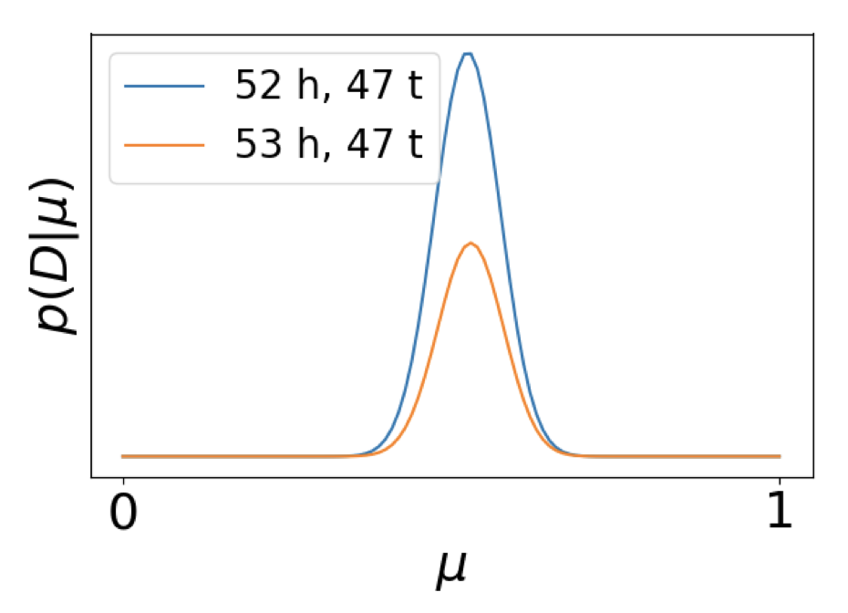
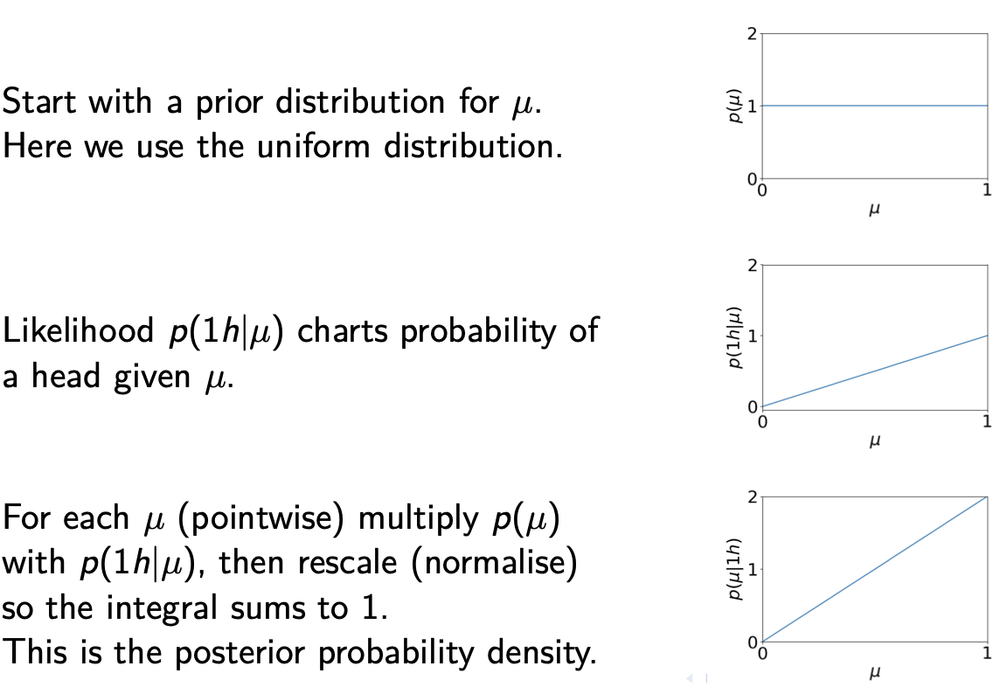
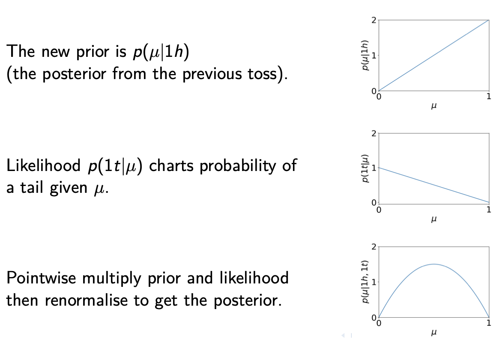
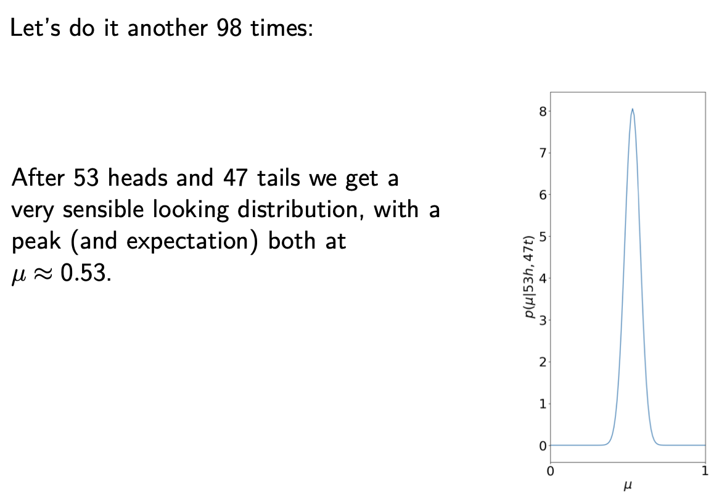
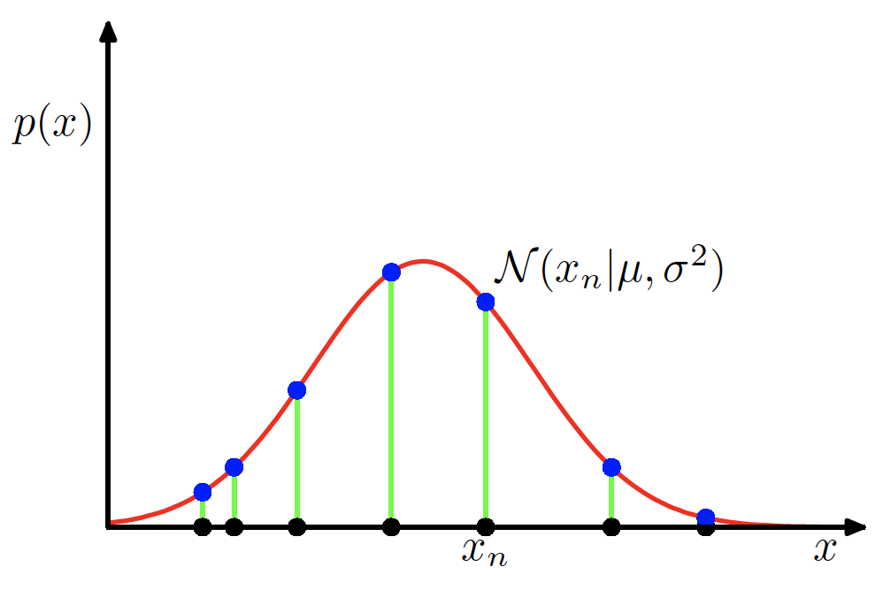
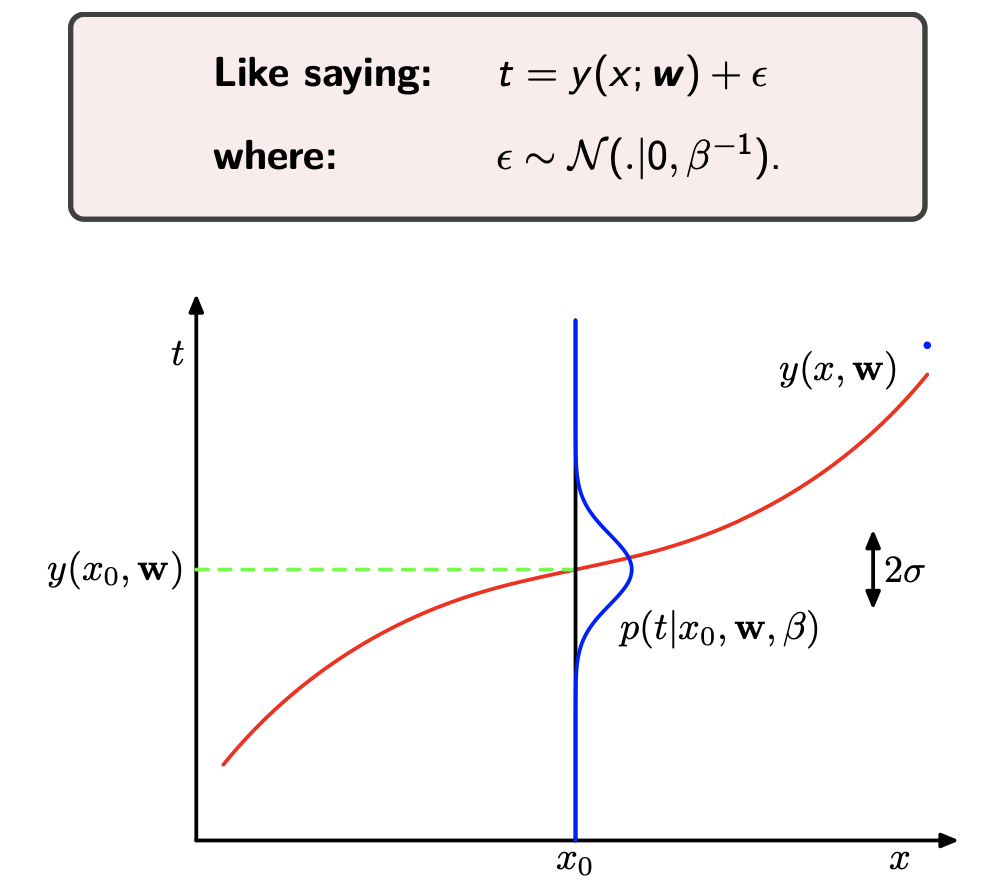
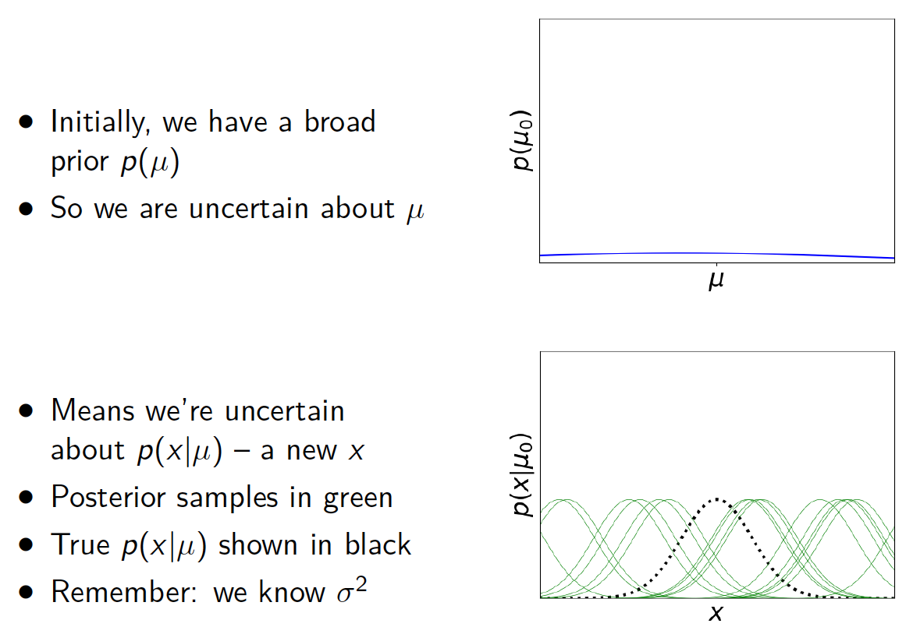
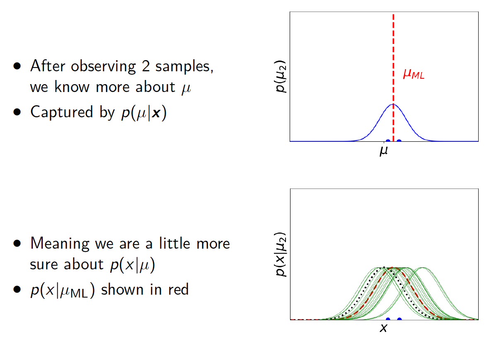
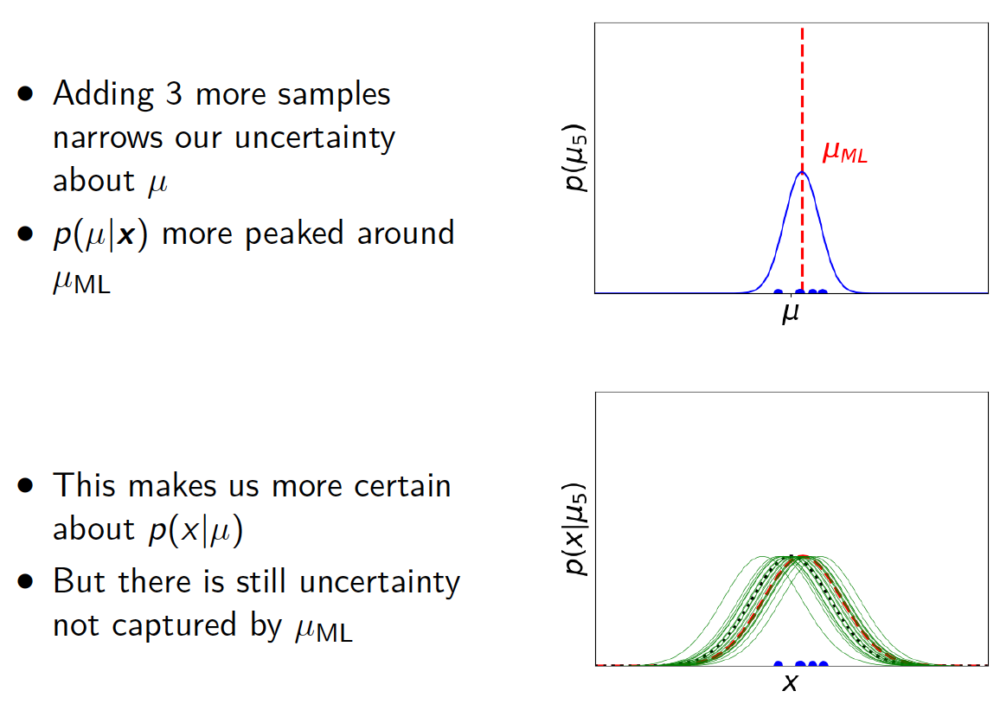
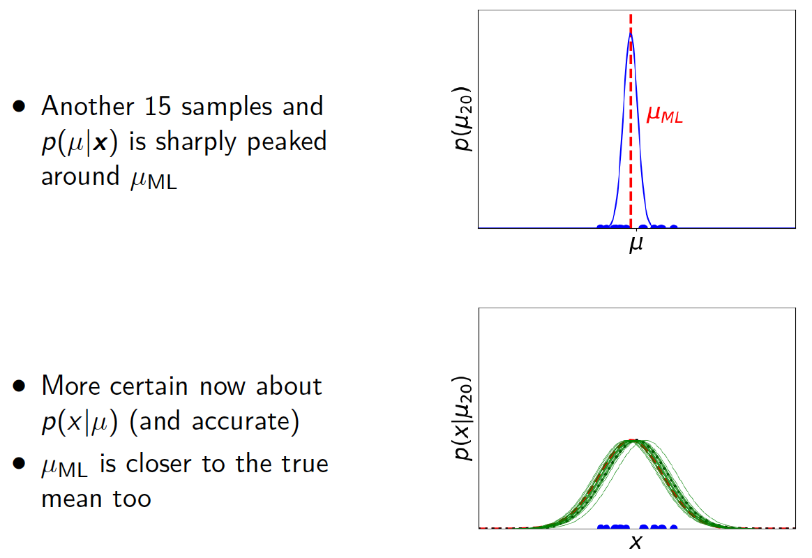

# Lecture 2: Data, Variables and Distributions - 20/01/20

## Binary Variables: Maximum Likelihood

### Example: Coin Tossing

Suppose we have a biased coin. At each toss we get:

-   Heads with probability $\mu$
-   Tails with probabilitu $1-\mu$

We toss the coin 100 times and observe 53 head and 47 tails. ***What is $\mu$?***

***The Frequentist Answer***: Pick the value of $\mu$ that makes the observations most probable.

### Mathematically Encoding

-   Each toss is a ***binary random variable*** $X$
-   $X$ can take two values: 1(head)/0(tail)
-   For known, $\mu$, $X$ follows the ***Bernoulli Distribution***:

$$
p(x|\mu) = p(X = x|\mu) = \mu^x(1-\mu)^{(1-x)}
$$

>   $p(x|\mu)$ is the plausibility of a probability $\mu$

-   Date $D = \{x_1 = 1, x_2 = 1, x_3 = 0, \dots\}$
-   ***Assume we knew*** $\mu$ then:

$$
p(D|\mu) = \prod_{n=1}^Np(x_n|\mu) = \prod_{n=1}^{N}\mu^{x_n}(1-\mu)^{(1-x_n)}
$$

***Frequentist View***: find the maximum of this

### Find Maximum

-   Differentiate $p(D|\mu)$ is difficult
-   But it is easier to find the maximum of $\ln p(D|\mu)$ and if $\mu^* = \arg\max_\mu f(\mu)$, then $\mu^* = \arg \max_\mu \ln f(\mu)$

>   Using $f(x) = \prod_{n=1}^N[g(x)], \ln f(x) = \sum_{n=1}^N[\ln g(x)]$

$$
\ln p(D|\mu) = \sum_n [x_n \ln \mu + (1-x_n) \ln (1-\mu)]
$$

>   Using $f(\mu) = x\ln\mu, \frac{d}{d\mu}f = \frac{x}{\mu}$

$$
\frac{d}{d\mu}\ln p(D|\mu) = \sum_n[\frac{x_n}{\mu}-\frac{1-x_n}{1-\mu}]
$$

Let $\frac{d}{d\mu}\ln p(D|\mu) =0$
$$
\begin{aligned}
\sum_n[\frac{x_n}{\mu}-\frac{1-x_n}{1-\mu}] &= 0\\
\sum_n\frac{x_n}{\mu} &= \sum_n \frac{1-x_n}{1-\mu} \\
\frac{1}{\mu}\sum_nx_n &= \frac{1}{1-\mu} \sum_n [1-x_n]\\
\frac{1}{\mu}\sum_nx_n &= \frac{N}{1-\mu} - \frac{1}{1-\mu}\sum_nx_n\\
\frac{1}{\mu\cancel{(1-\mu)}}\sum_nx_n &= \frac{N}{\cancel{1-\mu}}\\
\end{aligned}
$$

>   ***Maximiser:***
>   $$
>   \mu_{ML} = \frac{\sum_nx_n}{N}
>   $$

### Terminology

-   $p(D|\mu)$ is the ***joint probability*** of $D$
-   $p(D|\mu)$ is also the ***likelihood*** of $\mu$
-   In $p(D|\mu)$ is the ***log-likelihood*** of $\mu$
-   $\mu_{ML}$ Is the ***maximum-likelihood parameter***
-   As all $x_n \in D$ are drawn independently from the same distribution we say they are ***independent and identically distributed*** or ***i.i.d***

### Problems with Maximum-Likelihood

-   If we got two heads, $\mu =1$ is yielded, but not sensible
-   $\mu$ might not be a single answer

-   Insufficient data leads to uncertainty about $\mu$
-   Taking uncertainty into account leads to better reasoning

>   $p(D|\mu)$ is not a probability distribution over $\mu$ as the area under the curve isn't 1

## Bayesian Variables: A Bayesian Approach

[如何通俗理解Beta分布 - 知乎](https://www.zhihu.com/question/30269898)

>   $posterior \propto likelihood \times prior$

### Example: first coin is head and second coin is tail

## The Beta Distribution

>   The beta distribution describes continuous random-variables in the range $[0,1]$ and has the form:
>   $$
>   Beta(\mu|a,b) = \frac{\Gamma(a+b)}{\Gamma(a)\Gamma(b)} \mu^{(a-1)}(1-\mu)^{(b-1)}
>   $$
>
>   >   $$
>   >   \Gamma(n) = (n-1)! \forall n\in \N^+
>   >   $$
>
>   Ignore the normalisation:
>   $$
>   Beta(\mu|a,b) \propto \mu^{(a-1)}(1-\mu)^{(b-1)}
>   $$
>   
>
>   Mean:
>   $$
>   E(\mu|a,b) = \frac{a}{a+b}
>   $$
>   Variance:
>   $$
>   var(\mu|a,b) = \frac{ab}{(a+b)^2(a+b+1)}
>   $$
>   

### A Beta Prior

>   We choose a ***Beta prior*** $p(\mu) = Beta(\mu|a,b)= \mu^{(a-1)}(1-\mu)^{(b-1)}$ for our coin then observe $m$ heads and $l$ tails

>   *For uncluttered notation, we sometimes wirte $p(\mu) = p(\mu|a,b)$*

Using Bayes Theory our ***posterior*** looks like:
$$
\begin{aligned}
p(\mu|D) &\propto p(D|\mu)p(\mu)\\
& \propto \mu^m(1-\mu)^l\mu^{(a-1)}(1-\mu)^{(b-1)}\\
&= \mu^{(m+a-1)}(1-\mu)^{(l+b-1)}
\end{aligned}
$$
Once correctly ***normalised***:
$$
p(\mu |D) = Beta(\mu|m+a,l+b)
$$

>   New observation added to the experience data

>   When our posterior takes the same form as the prior, then the prior is said to be ***conjugate***

### Conjugate Beta Priors

With Beta prior $Beta(\mu|a,b)$ we observe $m$ heads and $l$ tails.

>   ***Prior Estimate:*** $E[\mu|a,b] = \frac{a}{a+b}$
>
>   ***Posterior Estimate:*** $E[\mu|a,b,m,l] = \frac{a+m}{a+m+b+l}$

Recall that $Beta(\mu|a,b) \propto \mu^{(a-1)}(1-\mu)^{(b-1)}$

-   Can interpret $a$ and $b$ as ***effective prior observations***
-   $a = 1$ and $b=1$ give a ***flat prior*** ($p(\mu)$ constant)
-   $a$ and $b$ must be greater than 0
-   $a$ and $b$ don't necessarily need to be integers

## Reak Valued Data

Another form of data we deal with regularly is unbounded reals $(x_n \in \R)$. Can often model this with a ***Gaussian***:

-   the Gaussian has many nice properties (as well will see)
-   reasons to expect data to be (approximately) Gaussian

>   a Gaussian prior can induce a Caussian posterior (conjugacy)

-   we can test data for its ***Gaussianity***

## The Gaussian (Normal) Distribution

$$
p(x|\mu,\sigma^2) = N(x|\mu,\sigma^2) = \frac{1}{\sqrt{2\pi\sigma^2}}\exp[-\frac{1}{2\sigma^2}(x-\mu)^2]
$$

for real values random samples $x_n \in \R$

***Properties***:

-   $N(x|\mu,\sigma^2) >0$ for $x \in \R$
-   $\int_{-\infty}^{\infty}N(x|\mu,\sigma^2) dx = 1$
-   $E[x] = \mu$
-   $var[x] = \sigma^2$

## Gaussian Likelihood

If we draw $N$ samples $\bold{x} = (x_1,\dots,x_N)^T$ ***i.i.d*** from our Gaussian, e.g. $x_n \sim N(x|\mu,\sigma^2)$

The ***likelihood*** is:
$$
\begin{aligned}
p(\bold{x}|\mu,\sigma^2) &= \prod_{n=1}^NN(x_n|\mu,\sigma^2) \\
& = \prod_{n=1}^{N}[\frac{1}{\sqrt{2\pi\sigma^2}}\exp[-\frac{1}{2\sigma^2}(x_n-\mu)^2]\\
& = (\frac{1}{\sqrt{2\pi\sigma^2}})^N \exp[-\sum_{n=1}^{N}\frac{1}{2\sigma^2}(x_n-\mu)^2] \\
& = (\frac{1}{\sqrt{2\pi\sigma^2}})^N \exp[- \frac{1}{2\sigma^2}[\sum_nx_n^2 - \sum_n2\mu x_n + N\mu^2]]
\end{aligned}
$$
Maximum likelihood parameters are a pair of values $\mu = \mu_{ML}, \sigma^2 = \sigma^2_{ML}$ that maximises the likelihood.

Easier to find maximisers using ***log likelihood***:
$$
\begin{aligned}
\ln p(\bold{x}|\mu,\sigma^2) &= N\ln (\frac{1}{\sqrt{2\pi\sigma^2}}) + \ln (\exp[- \frac{1}{2\sigma^2}[\sum_nx_n^2 - \sum_n2\mu x_n + N\mu^2]) \\
& = -\frac{N}{2}\ln(2\pi\sigma^2) - \frac{1}{2\sigma^2}[\sum_nx_n^2 - \sum_n2\mu x_n + N\mu^2]\\
& = -\frac{N}{2}\ln\sigma^2 - \frac{N}{2}\ln(2\pi) - \frac{1}{2\sigma^2}\sum_{n=1}^N(x_n-\mu)^2
\end{aligned}
$$
Differentiate $\ln p(\bold{x}|\mu,\sigma^2)$ and set to zero:
$$
\begin{aligned}
\frac{d}{d\mu} \ln p(\bold{x}|\mu,\sigma^2) &= -\frac{1}{2\sigma^2}\sum_{n=1}^{N}[-2x_n +2\mu]\\
let \space \frac{d}{d\mu} \ln p(\bold{x}|\mu,\sigma^2) &= 0\\
-\frac{1}{2\sigma^2}\sum_{n=1}^{N}[-2x_n +2\mu] & = 0\\
\sum_{n=1}^{N}\mu & = \sum_{n=1}^{N}x_n \\
\mu &= \frac{1}{N}\sum_{n=1}^{N}x_n\\
\\
\frac{d}{d\sigma^2} \ln p(\bold{x}|\mu,\sigma^2) & = -\frac{N}{2\sigma^2} + \frac{1}{2\sigma^4}\sum_{n=1}^{N}(x-M-\mu)^2 \\
let \frac{d}{d\sigma^2} \ln p(\bold{x}|\mu,\sigma^2) & = 0 \\
\frac{N}{2\sigma^2} & = \frac{1}{2\sigma^4}\sum_{n=1}^{N}(x_n-\mu)^2 \\
\sigma^2 & = \frac{1}{N}\sum_{n=1}^{N}(x_n-\mu)^2
\end{aligned}
$$
Thus
$$
\begin{aligned}
\mu_{ML} &= \frac{1}{N}\sum_{n=1}^{N}x_n\\
\sigma^2_{ML} & = \frac{1}{N}\sum_{n=1}^{N} (x_n-\mu_{ML})^2 
\end{aligned}
$$

## Maximum Likelihood Curve Fitting

>   ***Why assume Gaussian?***  Gaussian Distribution is a convinient default assumption, it makes the maths easy

M - order

Using the curve fitting example from ***Lecture 1***:

-   $N$ inputs $\bold{x} = (x_1,\dots,x_N)^T$
-   $N$ targets $\bold{t} = (t_1,\dots,t_N)^T$

Assume given $x_i$, then $t_i$ ***Gaussian*** with mean $y(x_i;\bold{w})$ (a polynomial with weights $\bold{w}$ ), i.e.
$$
p(t_i|x_i,\bold{w},\beta) = N(t_i|y(x_i;\bold{w}),\beta^{-1})
$$

>   ***Note that*** : $f(x;a,b,c)$  means $x$ is the independent variable while $a,b,c$ are the parameters

Where 
$$
y(x_i;\bold{w}) = \sum_{j=0}^{M}w_jx_i^j
$$
In which $M$ is the order of the hypothesis function.

$\beta$ is the ***precision*** (inverse variance), $\beta^{-1} = \sigma^2$

Using $\{\bold{x},\bold{t}\}$ to find the maximum likelihood parameters for $\bold{w}$ and $\beta$.  The likelihood:
$$
p(\bold{t}|\bold{x},\bold{w}) = \prod_{n=1}^{N}N(t_n|y(x_n;\bold{w}),\beta^{-1})
$$

>    ***Note that***: for this Gaussian distribution, the mean is $y(x_n;\bold{w})$ and the variance $\beta^{-1} $, and random variable being $t_n$

$$
\ln p(\bold{t}|\bold{x},\bold{w}) = - \frac{\beta}{2}\sum_{n=1}^{N}[y(x_n;\bold{w})-t_n]^2 + \frac{N}{2}\ln\beta - \frac{N}{2}\ln(2\pi)
$$

which, for $\bold{w}$, is the same as minimising:
$$
E(\bold{w}) = \frac{1}{2}\sum_{n=1}^{N}[y(x_n,\bold{w})-t_n]^2
$$

### Insights

-   maximising likelihood (minimising error) gives $\bold{w}_{ML}$ (independent of $\beta$)
-   can then find $\beta_{ML}$
-   now have predictive distribution for new samples $t$ given $x$: $p(t|x,\bold{w}_{ML},\beta_{ML}) = N(t|y(x;\bold{w}_{ML}),\beta_{ML})$, this measures uncertainty over $t$
-   doesn't measure uncertainty in $\bold{w}$ or $\beta$

## Gaussian: A More Bayesian View

### Moving Towards a More ***Bayesian*** View

Assume samples $\bold{x} = (x_1,\dots,x_n)^T$ from $N(x_i|\mu,\sigma^2)$

-   Assume we know the variance $\sigma^2$
-   Define prior on $\mu, p(\mu)$
-   But what shold the ***prior*** look like?

***Likelihood***:
$$
\begin{aligned}
p(\bold{x}|\mu) &= \prod_{n=1}^{N}N(x_n|\mu,\sigma^2)\\
& = \frac{1}{\sqrt{2\pi\sigma^2}^N}\exp[-\frac{1}{2\sigma^2}\sum_{n=1}^{N}(x_n - \mu)^2]
\end{aligned}
$$

>   Since the prior and the posterior should be conjugate

Using ***Bayes Rule***, the posterior: 
$$
p(\mu|\bold{x}) \propto p(\bold{x}|\mu)p(\mu)
$$

and the ***likelihood*** has form: 
$$
p(\bold{x}|\mu) \propto \exp[-\frac{1}{2\sigma^2}\sum_{n=1}^{N}(x_n - \mu)^2]
$$

>   This is an exponential that is (-ve) quadratic in $\mu$ since the index is $- \frac{1}{2\sigma^2}[\sum_nx_n^2 - \sum_n2\mu x_n + N\mu^2]$

So $p(\mu)$ should also have similar form:
$$
\begin{aligned}
p(\mu) & \propto \exp [-\frac{(\mu-m_0)^2}{2s_0^2}] \\
& \propto N(\mu|m_0,s_0^2)
\end{aligned}
$$

>   ***Prior*** is  a ***Gaussian***

From conjugacy, we know the ***posterior*** will also be Gaussian, so
$$
p(\mu|\bold{x}) = N(\mu|m_N,s_N^2)
$$
By working through the maths:
$$
\begin{aligned}
m_N & = \frac{\sigma^2}{Ns_0^2+\sigma^2}m_0 + \frac{Ns_0^2}{Ns_0^2 +\sigma^2}\mu_{ML} \\
\frac{1}{s_N^2} & = \frac{1}{s_0^2} + \frac{N}{\sigma^2}
\end{aligned}
$$
where $\mu_{ML}$ is the ***maximum likelihood mean*** from before:
$$
\mu_{ML} = \frac{1}{N}\sum_{n=1}^{N}x_n
$$

### Insight

-   $m_N$ is compromise between $m_0$ and $\mu_{ML}$
-   For large $N$, $m_N \approx \mu_{ML}$ (refer to ***Lecture 1***)
-   Precisions, e.g. $\frac{1}{\sigma^2}$, more natural than variance
-   For large $N$, variance of estimate vanishes, i.e. $s_N^2 \approx 0$
-   As $s_0^2 \to \infty$, then $s_N^2 \to \frac{\sigma^2}{N}$

## Machine Learning Application

