# Lecture 3: Regression in Linear Models - 27/01/20

## Linear Regression

A simple ***linear model*** for vector inputs $\bold{x} \in \R^{D-1}$:
$$
\begin{aligned}
y (\bold{x}) &= \sum_{d=1}^{D-1} w_dx_d \\
& =
\begin{pmatrix}
w1 &\dots &w_{D-1}
\end{pmatrix}
\begin{pmatrix}
x_1 \\
\vdots\\
x_{(D-1)}
\end{pmatrix} \\
& = 
\begin{pmatrix}
w_1\\
\vdots\\
w_{(D-1)}
\end{pmatrix}^T
\begin{pmatrix}
w_1 \\
\vdots \\
x_{(D-1)}
\end{pmatrix} \\
& = \bold{w}^T\bold{x}
\end{aligned}
$$
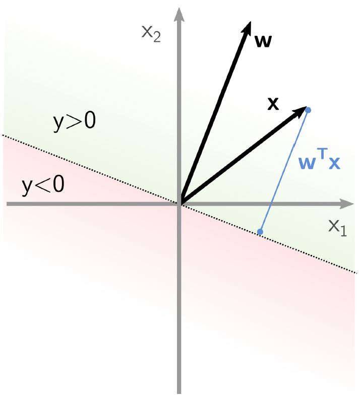

$y = 0$ is defined as the ***decision line***

### A Simple Neuron

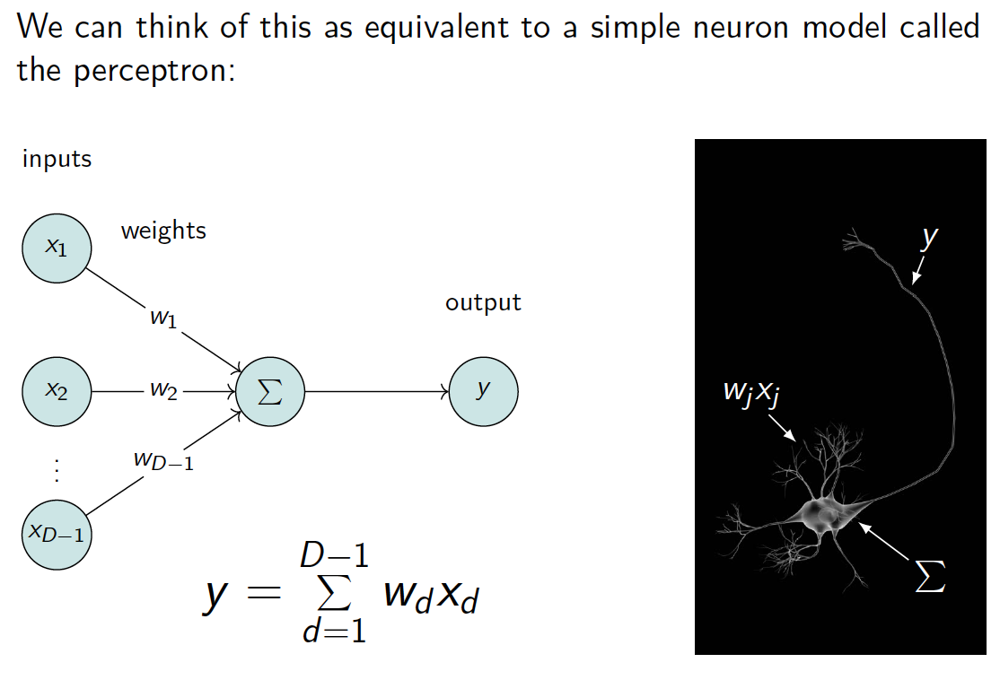

### Bias Term

We introduce a ***bias term***:
$$
\begin{aligned}
y(\bold{x}) &= w_0 + \sum_{d=1}^{D-1} w_dx_d \\
& = w_0 + \bold{w}^T\bold{x}
\end{aligned}
$$
For a point on the decision line:
$$
\begin{aligned}
y(\bold{x}) &= 0\\
\frac{\bold{w}^T\bold{x}}{||\bold{w}||}& = -\frac{w_0}{||\bold{w}||}
\end{aligned}
$$
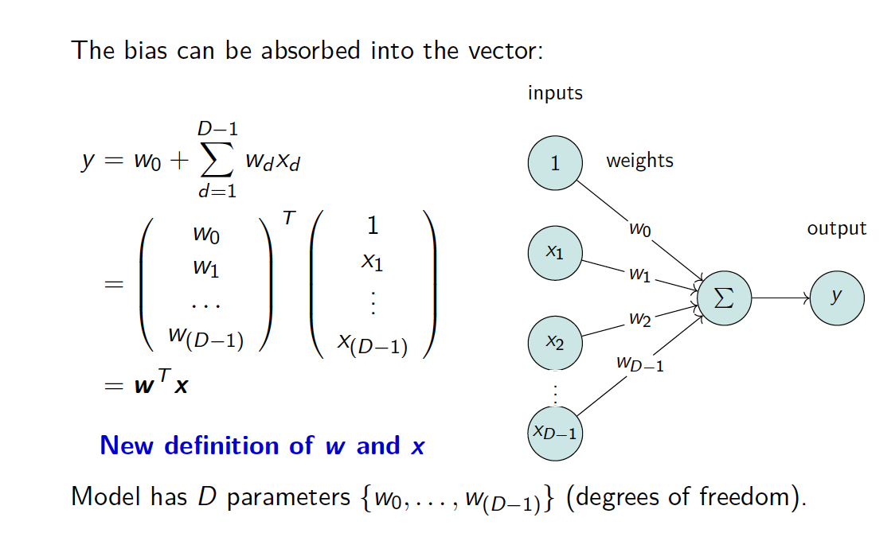

### Solving the Linear Model

Each input is a vector $\bold{x}_n \in \R^D$, with corresponding target, $t \in \R$. We want to minimise the ***sum-of-square errors***, with the ***error function*** being:
$$
E_D(\bold{w}) = \frac{1}{2} \sum_{n=1}^N (t_n - \bold{w}^T\bold{x}_n)^2
$$
Rewrite in matrix notation:
$$
E_D(\bold{w}) = \frac{1}{2}(\bold{t} - \bold{X}\bold{w})^T(\bold{t} - \bold{X}\bold{w})
$$
with $\bold{t} \in \R^N$ is our collected targets and $(N \times D)$-matrix of inputs:
$$
\bold{X} = 
\begin{pmatrix}
x_{10} & x_{11} & \dots & x_{1(D-1)} \\
x_{20} & x_{21} & \dots & x_{2(D-1)} \\
\vdots & \vdots & \ddots & \vdots \\
x_{N0} & x_{N1} & \dots & x_{N(D-1)} \\
\end{pmatrix}
$$

>   ***Note that***:  each row vector $\bold{x}_i^T$  is $i$th data input while each column vector is a set of data input $\tilde{\bold{x}}_j$ for $j$th demension

Minimise the error function $E_D(\bold{w})$ by differentiating and setting to zero:
$$
\begin{aligned}
\nabla_\bold{w}E_D(\bold{w}) = \nabla_\bold{w}[\frac{1}{2}(\bold{t} - \bold{X}\bold{w})^T(\bold{t} - \bold{X}\bold{w})] &= 0 \\
-\bold{X}^T(\bold{t}-\bold{X}\bold{w}^*) &= 0 \\
\end{aligned}
$$
Expanding brackets, rearraging, multipling by $(\bold{X}^T\bold{X})^{-1}$
$$
\begin{aligned}
\bold{X}^T\bold{X}\bold{w}^* &= \bold{X}^T\bold{t} \\
(\bold{X}^T\bold{X})^{-1}\bold{X}^T\bold{X}\bold{w}^* &= (\bold{X}^T\bold{X})^{-1}\bold{X}^T\bold{t}  \\
\bold{w}^* &= (\bold{X}^T\bold{X})^{-1}\bold{X}^T\bold{t}
\end{aligned}
$$

>   ***Most Likelihood Weights Linear Regression***:
>   $$
>   \bold{w}^* = (\bold{X}^T\bold{X})^{-1}\bold{X}^T\bold{t} = \bold{w}_{ML}
>   $$

>   ***The Gradient Operator*** $\nabla_\bold{w}$
>
>   The gradient operator is vector of (partial) differential operations that gives direction of maximum ascent
>   $$
>   \nabla_\bold{w}f = \frac{df}{d\bold{w}} = (\frac{\delta f}{\delta w_0},\dots,\frac{\delta f}{\delta w_{(D-1)}})^T
>   $$
>   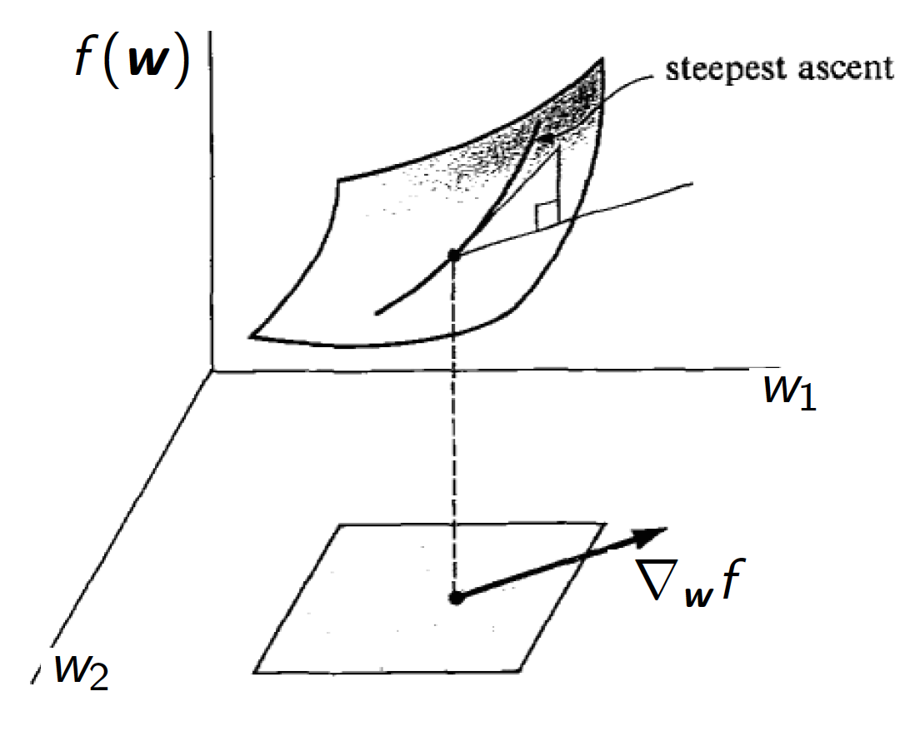
>
>   ***Properties:***
>
>   -   Gradient of dot product: $\nabla_\bold{w}\bold{w}^T\bold{v} = \bold{v}$
>
>   -   Product rule: $\nabla_\bold{x}u(\bold{x})v(\bold{x}) = v\nabla_\bold{x}u + u\nabla_\bold{x}v$
>   -   Chain rule: $\nabla_\bold{z}f(g(\bold{z})) = \frac{df}{dg}\nabla_\bold{z}g$

>   ***The Moore-Penrose Pseudo-Inverse***
>   $$
>   (\bold{A}^T\bold{A})^{-1}\bold{A}^T = \bold{A}^{\dagger} \in \R^{M \times N}
>   $$
>   $\bold{A}^\dagger$ is defined as the Moore-Penrose pseudo-inverse of matrix $\bold{A}$, which provides properties similar to the inverse of a square matrix for non-square matrix:
>
>   -   Not a real inverse: $\bold{A}\bold{A}^\dagger \ne \bold{I}$ 
>   -   Almost an inverse: $\bold{A}\bold{A}^\dagger\bold{A} = \bold{A}$
>   -   If $\bold{A}$ is square and invertible then $\bold{A}^\dagger = \bold{A}^{-1}$
>   -   Can be problematic if $\bold{A}^T\bold{A}$ is ( or close to ) singular

### Geometric Intuition

$$
\bold{X} = 
\begin{pmatrix}
x_{10} & x_{11} & \dots & x_{1(D-1)} \\
x_{20} & x_{21} & \dots & x_{2(D-1)} \\
\vdots & \vdots & \ddots & \vdots \\
x_{N0} & x_{N1} & \dots & x_{N(D-1)} \\
\end{pmatrix}
$$

-   Row Vector $\bold{x}_i^T$  

-   Column Vector $\tilde{\bold{x}}_j \in \R^N$

-   $\bold{t}$ is a vector in $\R^N$

-   $S$ is (sub-)space spanned by $\{\tilde{\bold{x}}_d\}$

-   $\dim(S) \leq D$

    >   Some of the data input might not be linearly independent

-   $\bold{y} = \bold{X}\bold{w}^*$ is point in $S$ closest to $\bold{t}$

## $k$NN for Regression

$k$***-Nearest Neighbours*** ($k$***NN***) assumes estimates $y(\bold{x}) \& y(\bold{x}')$ are similar, when $\bold{x}$ is close to $\bold{x}'$:

Predicts:
$$
y(\bold{x},k) = \frac{1}{k}\sum_{\bold{x}_i\in\N_k(\bold{x})}t_i
$$
when $\N_k{\bold{x}}$ contains the $k$ closest points to $\bold{x}$

>   In words, ***predict for $y(\bold{x})$ the average target of the $k$ nearest points***

-   A closeness measure, e.g. Euclidean distance, is required
-   Usualy more common for ***classification***

### Pseudocode

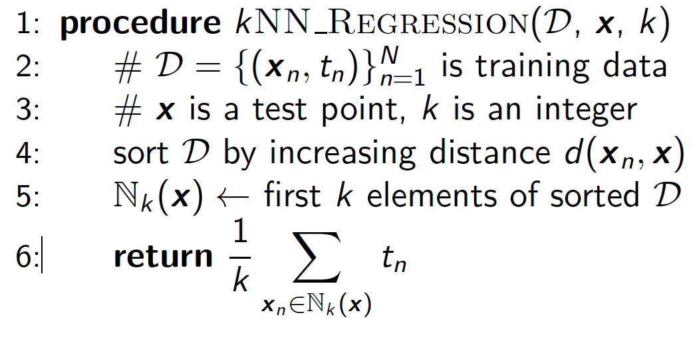

### Insights

-   No training phase
-   Evaluation is expensdive, sort is $O(N\log  N)$
-   Seems like it has one parameter, $k$
-   Actually has $\frac{N}{k}$ effective paramters

### One-Dimensional $k$NN

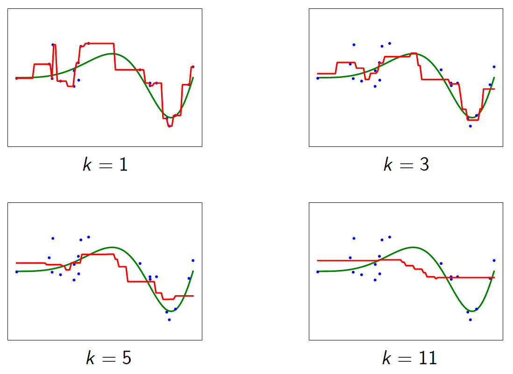

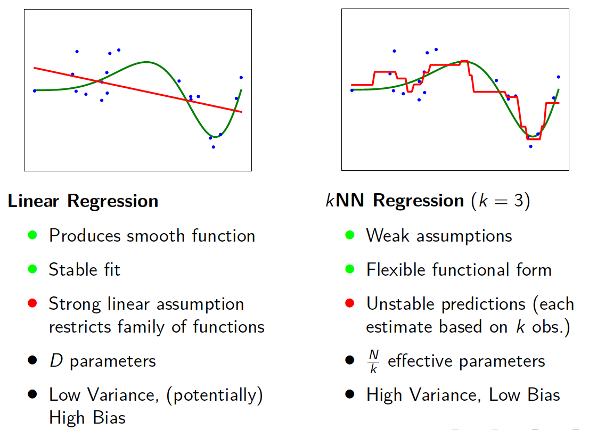

## Linear Models

Consider a ***simple linear regression*** with vector inputs:
$$
y(\bold{x},\bold{w}) = w_0 +\sum_{d=1}^D w_dx_d
$$
with vector input data, $\bold{x} = (x_1,\dots,x_D)$. 

>   Linear in both ***weights*** and ***input variables*** $x_i$

Extending that to consider:
$$
y(\bold{x},\bold{w}) = w_o +\sum_{j=1}^{M-1} w_j \phi_j(\bold{x})
$$
where $\phi_j(\bold{x})$ are ***basis functions***. For instance, a monomial function: $\phi_j(\bold{x}) = \sum_ix_i^j$

>   Also a ***linear model*** (linear in the weights, $\bold{w}$)

Extended linear model:
$$
y(\bold{x},\bold{w}) = w_o +\sum_{j=1}^{M-1} w_j \phi_j(\bold{x}) = \sum_{j=0}^{M-1} w_j\phi_j(\bold{x})
$$
where $\phi_0(\bold{x}) = 1$

Rewrite in vector form as:

>   ***Linear Model Prediction***
>   $$
>   y(\bold{x},\bold{w}) = \phi(\bold{x})^T\bold{w}
>   $$
>   where $\phi(\bold{w})$ is our ***feature vector***, defined as:
>   $$
>   \phi(\bold{x}) = (\phi_o(\bold{x}),\phi_1(\bold{x}),\dots,\phi_{M-1}(\bold{x}))^T
>   $$

### Example: Polynomial Basis Funtcion

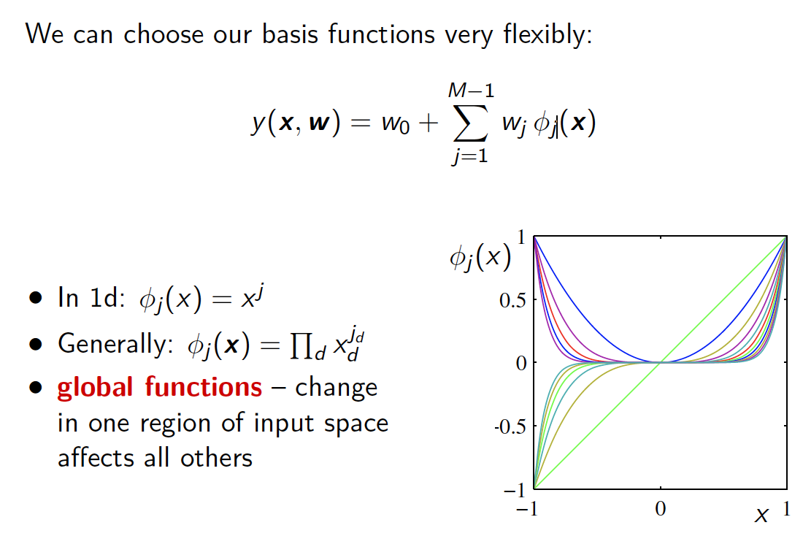

### Example: Radial Basis Function

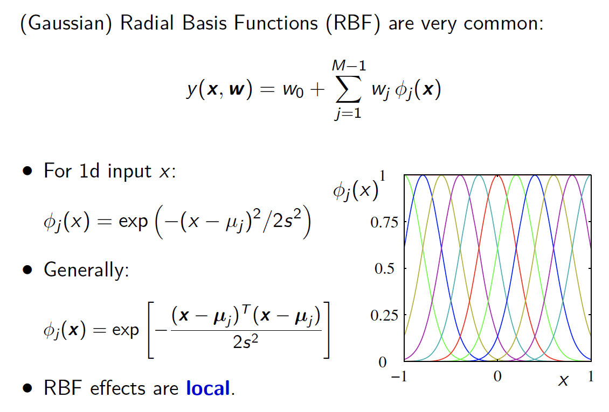

### Example: S-Shape Function

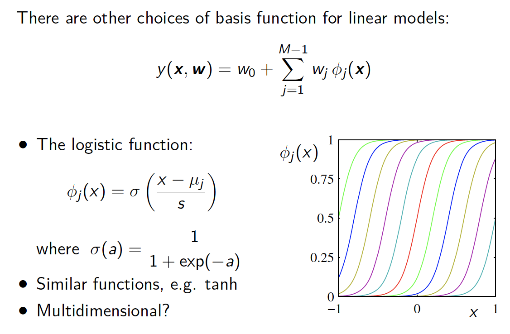

### Linear Models: Geometric Intuition

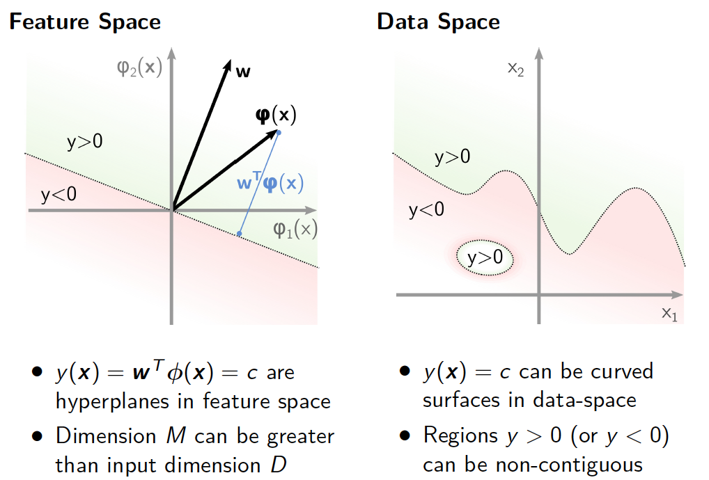

## Fitting Linear Models

Assuming target $t$ given by deterministic component plus ***Gaussian noise***:
$$
t = y(\bold{x};\bold{w}) + \epsilon
$$
where $y(\bold{x};\bold{w}) = \phi(\bold{x}_n)^T\bold{w}$ and $\epsilon \sim N(.|0,\beta^{-1})$

>   The ***probability density*** for target $t$:
>   $$
>   p(t|\bold{x},\bold{w},\beta) = N(t|\phi(\bold{x}_n)^T\bold{w},\beta^{-1})
>   $$
>   The ***conditional mean***:
>   $$
>   E[t|\bold{x},\bold{w},\beta] = \int t p(t|\bold{x},\bold{w},\beta) dt = y(\bold{x},\bold{w})
>   $$

Collect all inputs together into data matrix $\bold{X} = (x_1^T,\dots,x_N^T)^T$ with vector of corresponding targets $\bold{t} = (t_1,\dots,t_N)^T$ now likelihood is :
$$
p(\bold{t}|\bold{X},\beta) = \prod_{n=1}^NN(t_n|\phi(\bold{x}_n)^T\bold{w},\beta^{-1})
$$
Taking log:
$$
\begin{aligned}
\ln p(\bold{t}|\bold{X},\beta) &=\sum_{n=1}^N\ln N(t_n|\phi(\bold{x}_n)^T\bold{w},\beta^{-1}) \\
&= \frac{N}{2}\ln \beta -\frac{N}{2}\ln(2\pi) - \beta E_D(\bold{w})
\end{aligned}
$$
with ***sum-of-squares error***:
$$
E_D(\bold{w}) = \frac{1}{2} \sum_{n=1}^N(t_n - \phi(\bold{x}_n)^T\bold{w})^2
$$

### Fitting with Different Basis Functions

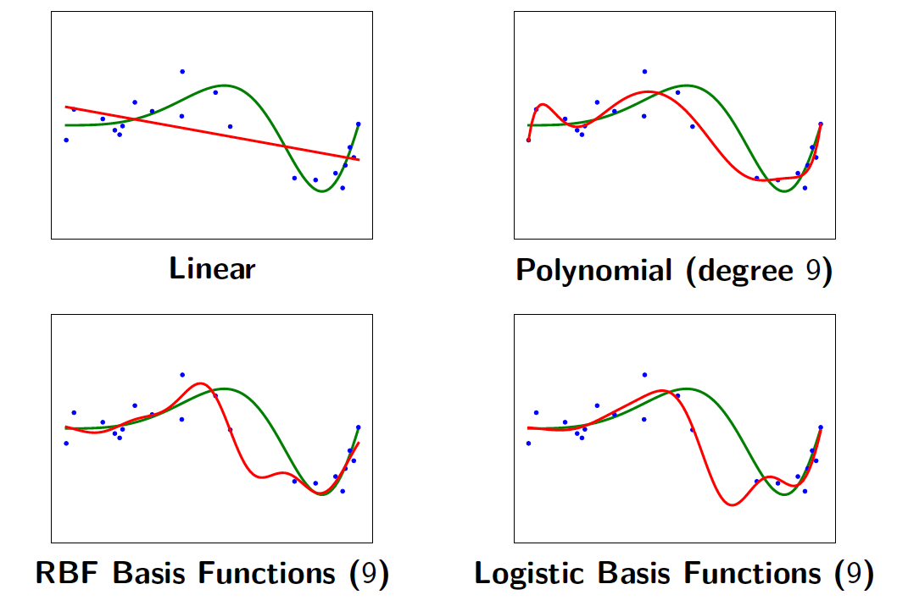

### Finding the Maximum Likelihood

Since the function is ***quadratic*** in $\bold{w}$, there is a single maximum. To maximise the likelihood, differentiate and set to zero:
$$
\nabla_\bold{w}\ln p(\bold{t}|\bold{X},\beta) = \beta \nabla_\bold{w} E_D(\bold{w}) = 0
$$
Rewrite ***error function*** in matrix form, differentiate and set to zero:
$$
\begin{aligned}
E_D(\bold{w}) &= \frac{1}{2}(\bold{t} - \Phi\bold{w})^T(\bold{t} - \Phi\bold{w}) \\
\nabla_{\bold{w}}E_D(\bold{w}) &=  -\bold{\Phi}^T(\bold{t}-\bold{\Phi}\bold{w}) = 0 \\
\Phi^T\Phi\bold{w} &= \Phi^T\bold{t} \\
\cancel{(\Phi^T\Phi)^{-1}\Phi^T\Phi}\bold{w} &= (\Phi^T\Phi)^{-1}\Phi^T\bold{t} = \Phi^\dagger\bold{t}\\
\end{aligned}
$$
where we have defined the design matrix as:
$$
{\Phi} = 
\begin{pmatrix}
\phi_0 (\bold{x}_1) & \phi_1 (\bold{x}_1)  & \dots &\phi_{M-1} (\bold{x}_1)\\
\phi_0 (\bold{x}_2) & \phi_1 (\bold{x}_2)  & \dots &\phi_{M-1} (\bold{x}_2)\\
\vdots &\vdots & \ddots & \vdots \\
\phi_0 (\bold{x}_N) & \phi_1 (\bold{x}_N)  & \dots &\phi_{M-1} (\bold{x}_N)
\end{pmatrix}
$$

>   ***ML Weights Linear Model:***
>   $$
>   \bold{w}_{ML} = (\Phi^T\Phi)^{-1}\Phi^T\bold{t} = \Phi^\dagger\bold{t}
>   $$

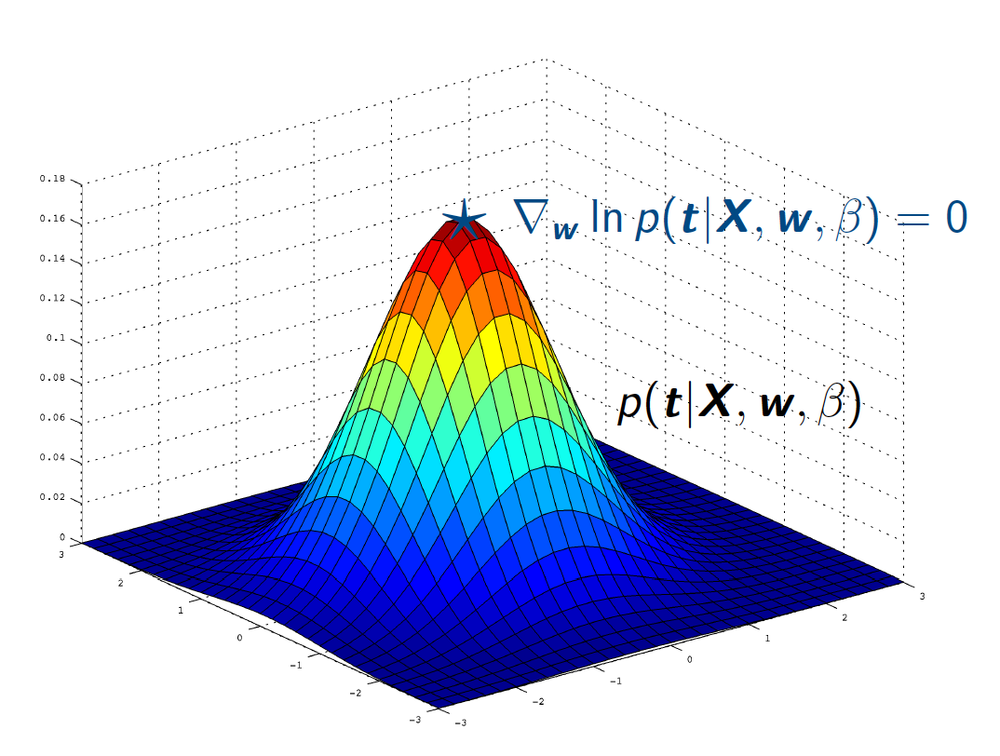

### Regularised Least Squares

Regularisation by introducing an ***error term that penalises large weight values***:
$$
\tilde{E}(\bold{w}) = E_D(\bold{w}) + \lambda E_W(\bold{w})
$$
As before:
$$
E_D(\bold{w}) = \frac{1}{2} \sum_{n=1}^N(t_n - \phi(\bold{x}_n)^T\bold{w})^2
$$

#### Ridge Regression

For ***ridge regression***, weight penalty is $\lambda||\bold{w}||^2$, giving:
$$
E_W(\bold{w}) = \frac{1}{2}\bold{w}^T\bold{w} = \frac{1}{2}||\bold{w}||^2
$$
where $\lambda $ is the ***regularisation coefficient***, controlling the relative importance of the two error terms. Total error function is now:
$$
\begin{aligned}
\tilde{E}(\bold{w}) &= \frac{1}{2} \sum_{n=1}^N(t_n - \phi(\bold{x}_n)^T\bold{w})^2 + \frac{\lambda}{2}||\bold{w}||^2 \\
& = \frac{1}{2}(\bold{t} - \Phi\bold{w})^T(\bold{t} - \Phi\bold{w})  + \frac{\lambda}{2}\bold{w}^T\bold{w}
\end{aligned}
$$
Differentiate, and set to zero:
$$
\begin{aligned}
\nabla_\bold{W} \tilde{E}(\bold{w}) = -\bold{\Phi}^T(\bold{t}-\bold{\Phi}\bold{w}) + \lambda\bold{w} &= 0\\
-\Phi^T\bold{t} + \Phi^T\Phi\bold{w} +\lambda\bold{w} &= 0\\
(\Phi^T\Phi + \lambda I)\bold{w} &= \Phi^T\bold{t} \\
\bold{w} &= (\Phi^T\Phi + \lambda I)^{-1}\Phi^T\bold{t}
\end{aligned}
$$
The error function for ***ridge regression*** (also know as ***weight decay***) is quadratic which means it has a closed form solution too:

>   **Regularised Weights Linear Model***:
>   $$
>   \bold{w}^* = (\Phi^T\Phi + \lambda I)^{-1}\Phi^T\bold{t}
>   $$

#### Lasso

Other regularisation terms are also possible. For instance, ***sum-of-absolute-values***:
$$
E_W(\bold{w}) = \frac{1}{2}\sum_{j=1}^M|w_j|
$$

-   This approach is know as ***lasso***
-   If $\lambda$ is sufficiently large, can lead to a ***sparse model***: where most weight coefficients $w_j$ are exactly zero.
-   Sparse models can be more ***robust*** (resistant to over-fitting)

>   No general closed form solution for $\bold{w}$

