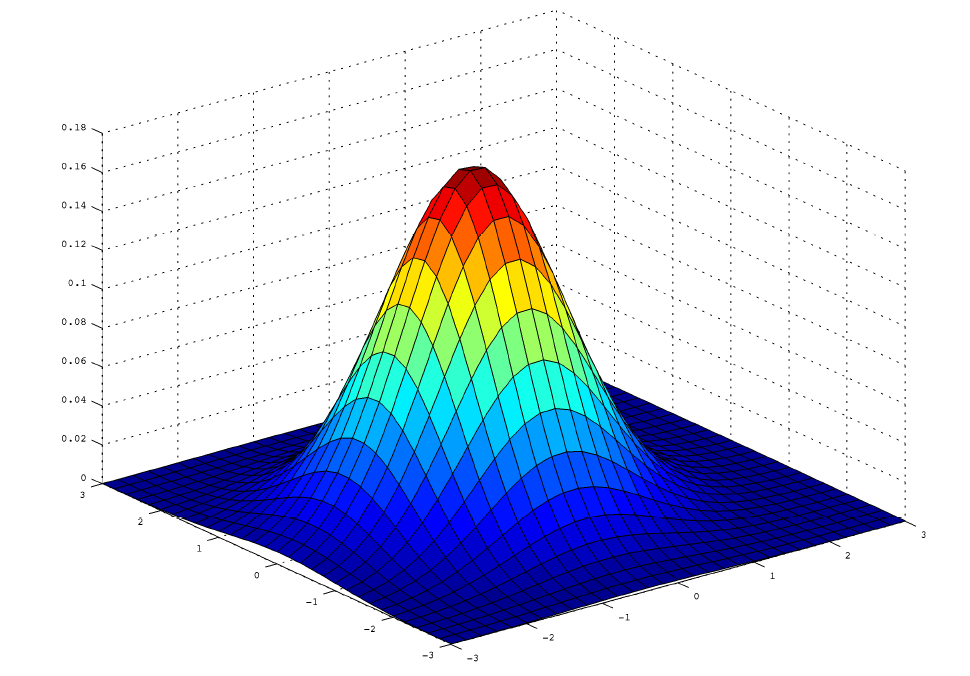
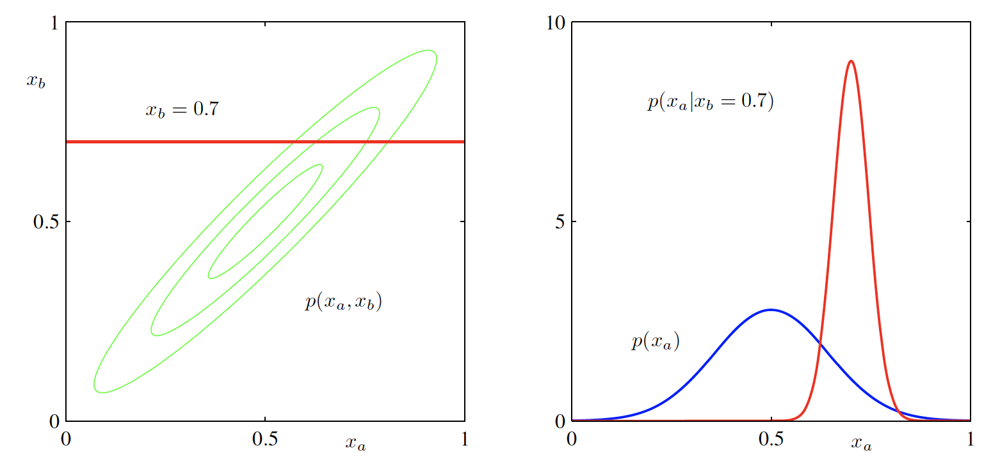
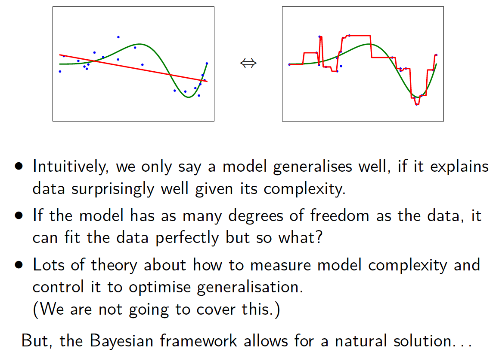
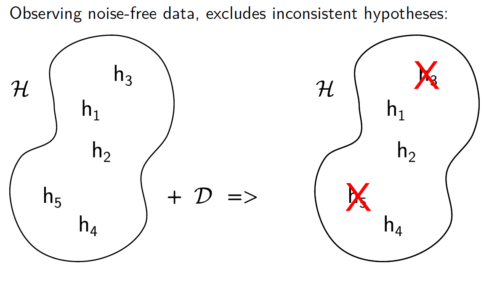
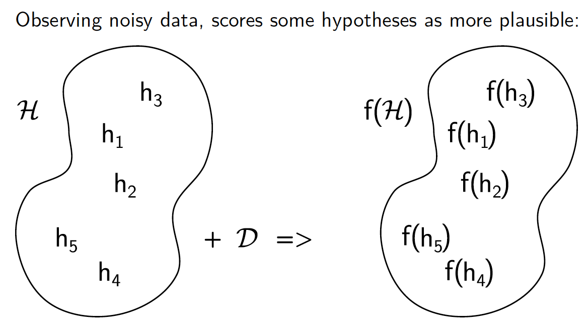
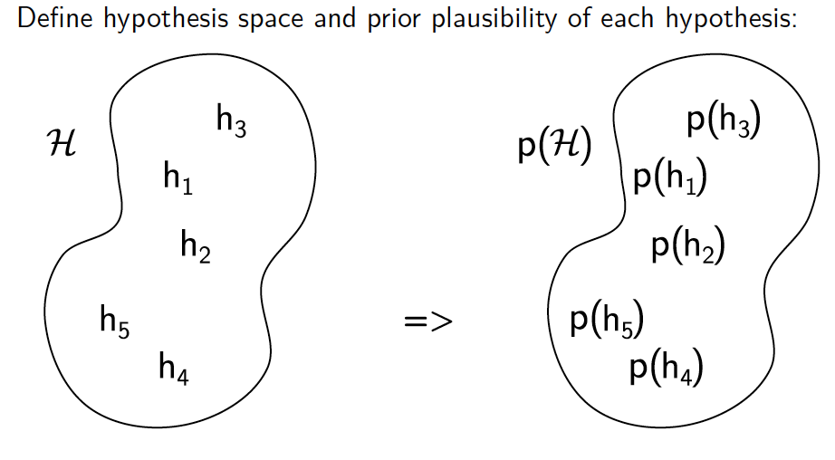
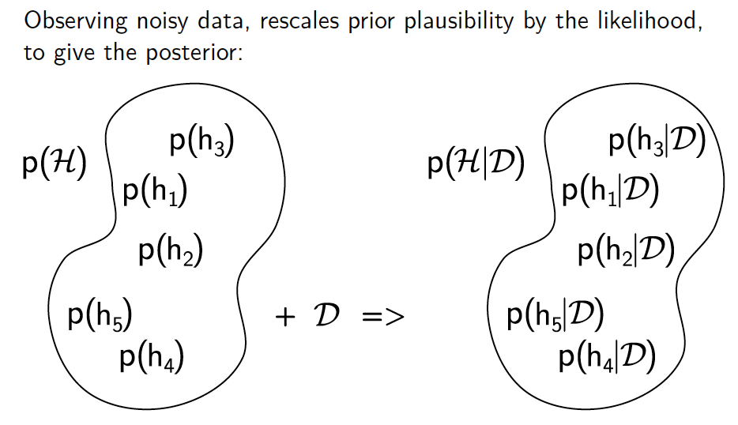
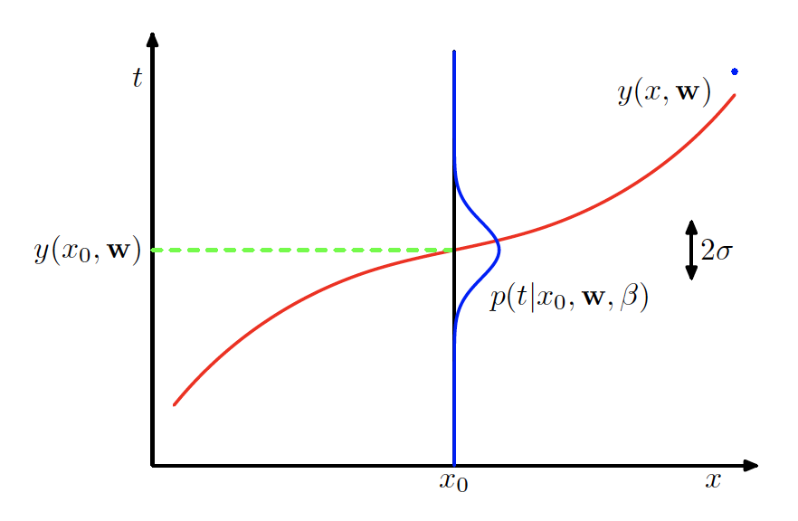
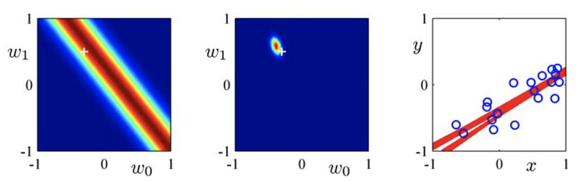
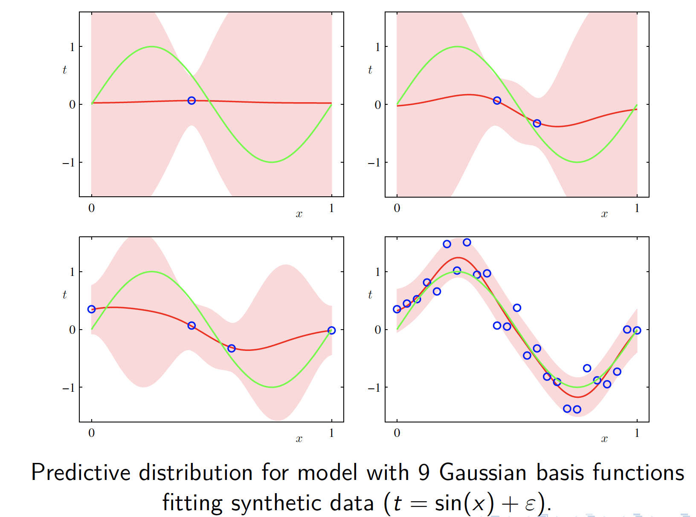

# Lecture 4: The Multivariate Gaussian & Bayesian Regression - 03/02/20

## Revision: Bayes Rule

***Bayes Rule*** allows us to reason about random variables:
$$
p(x|y) = \frac{p(y|x)p(x)}{p(y)} \propto p(y|x)p(x)
$$
***Conjugacy*** means that prior and posterior have the same form, e.g.
$$
Beta(\mu|a+m,b+l) \propto \mu^m (1-\mu)^l \times Beta(\mu|a,b)
$$

## Bayesian Inference on Regression Weights

By combining the ***linear model regression*** and ***Bayes rule***, we can reason about ***regression weights***, $\bold{w}$
$$
p(\bold{w}|D,\theta) = \frac{p(D|\bold{w})p(\bold{w}|{\theta})}{p(D)} \propto p(D|\bold{w})p(\bold{w}|\theta)
$$
with $\theta$ as the initial parameters

## The Multivariate Gaussian Distribution

-   a multi-dimensional ***generalisation*** of the Gaussian

-   data-points are $D>1$ dimensional vectors, e.g. $\bold{x}_n \in \R^D$

The probability density function (p.d.f) is:
$$
N(\bold{x}|\bold{\mu},\bold{\Sigma}) = \frac{1}{(2\pi)^{\frac{D}{2}}}\frac{1}{|\bold{\Sigma|}^\frac{1}{2}}\exp[-\frac{1}{2}(\bold{x} - \bold{\mu})^T \bold{\Sigma}^{-1}(\bold{x} - \bold{\mu})]
$$
with

-   $\bold{\mu} = E[\bold{x}]$ is the ***<u>vector</u> mean***
-   $\bold{\Sigma}$ is the ***covariance matrix***
-   $|\bold{\Sigma}|$ is its ***<u>scalar</u> determinant***
-   $\bold{\Sigma}^{-1}$ is its ***inverse matrix***

>   The ***Covariance Matrix*** $\bold{\Sigma} $ is the multi-dimensional analog of the variance. It is ***symmetric***, and influences the ***shape*** and ***dispersion*** of the distribution.
>   $$
>   [\bold{\Sigma}]_{i,j} = \mathrm{cov}[x_i,x_j]
>   $$

>   The Mahalanobis Distance $\Delta$ is the analog of $\frac{x-\mu}{\sigma} $ in unidimensional Gaussian Distribution under the multivariate case. It is the distance of a data point from the mean value generalised by the co-variance.
>   $$
>   \Delta^2 = (\bold{x}-\bold{\mu})^T \bold{\Sigma}^{-1}(\bold{x} - \bold{\mu})
>   $$

>   ***Note that***: two data points that have the same Mahalanobis Distance from the data mean have the same probability density. All of these points form the ***Equiprobability Surface***
>
>   

### Conditionals and Marginals

Conveniently for Multivariate Gaussian, many conditionals and marginals are also ***Gaussian***

## Block Matrix Notation

Block matrix notation expresses larger arrays in terms of smaller ones 

For vectors:
$$
\bold{x} = (x_1,x_2,\dots, x_k)^T = 
\begin{pmatrix}
\bold{x}_a \\
\bold{x}_b
\end{pmatrix} = 
\begin{pmatrix}
\bold{x}_a^T \bold{x}_b^T
\end{pmatrix}^T
$$
Where $\bold{x}_a = (x_1,x_2, \dots, x_j)^T$ and $\bold{x}_b = ({x_{j+1}, x_{j+2}, \dots, x_k})^T$

For matrices:
$$
\bold{\Sigma} = 
\begin{pmatrix}
\bold{\Sigma}_{aa} \ \bold{\Sigma}_{ab} \\
\bold{\Sigma}_{ba} \ \bold{\Sigma}_{bb}
\end{pmatrix}
$$
Where $\bold{\Sigma}_{aa}, \bold{\Sigma}_{ab}, \bold{\Sigma}_{ba}, \bold{\Sigma}_{bb}$ are the submatrices. $\bold{\Sigma}_{aa}$ and $\bold{\Sigma}_{bb}$ are ***square*** matrices.

Just like the unidimensional $\beta$, ***Precision Matrix***:
$$
\bold{\Lambda}^{-1} \equiv \bold{\Sigma} 
$$

>   ***Note that***: $\bold{\Lambda}^{-1}_{aa} \ne \bold{\Sigma}_{aa}$

## Partitioned Gaussians

For any Gaussian, $N(\bold{x}|\bold{\mu},\bold{\Lambda}^{-1})$ with $\bold{\Lambda^{-1}} = \bold{\Sigma}$, $\begin{aligned}\bold{x} = \begin{pmatrix}\bold{x}_a \\ \bold{x}_b\end{pmatrix}\end{aligned}$, $\bold{\mu} = \begin{pmatrix}\bold{\mu}_a \\ \bold{\mu}_b\end{pmatrix}$, $\bold{\Lambda} = \begin{pmatrix}\bold{\Lambda_{aa}} \ \bold{\Lambda_{ab}} \\ \bold{\Lambda_{ba}} \ \bold{\Lambda_{bb}}\end{pmatrix}$

>   The ***conditional distribution*** of $\bold{x}_a$ given $\bold{x}_b$ is ***Gaussian***
>   $$
>   p(\bold{x}_a|\bold{x}_b) = N(\bold{x}|\bold{\mu}_{a|b},\bold{\Lambda}_{a|b}^{-1})
>   $$
>   Where $\mathbf{\mu}_{a|b} = \bold{\mu}_a - \bold{\Lambda}_{aa}^{-1}\bold{\Lambda}_{ab}(\bold{x}_b - \bold{\mu}_b)$ and $\bold{\Lambda}_{a|b} = \bold{\Lambda}_{aa}$

>   The ***marginal distribution*** of $\bold{x}_a$ is also ***Gaussian***
>   $$
>   p(\bold{x}_a) = N(\bold{x}|\bold{\mu}_a,\bold{\Lambda}_a^{-1})
>   $$
>   where $\bold{\Lambda}_a = \bold{\Lambda}_{aa}$

## Dependent Gaussian

Similarly nice properties hold when we combine Gaussians. For instance, assume we have marginal and conditional Gaussian distributions:
$$
\begin{aligned}
p(\bold{x}) &= N(\bold{x}|\bold{\mu},\bold{\Lambda}^{-1}) \\
p(\bold{y}|\bold{x}) &= N(\bold{y}|\bold{Ax} + \bold{b}, \bold{L}^{-1})
\end{aligned}
$$
In which the ***mean*** for $p(\bold{y}|\bold{x})$ is some <u>matrix linear operations</u> $\bold{Ax} + \bold{b}$ involving $\bold{x}$ and the some ***precision matrix*** $\bold{L}$ . 

>   The ***marginal distribution*** of $\bold{y}$ is Gaussian
>   $$
>   p(\bold{y}) = N(\bold{y}|\bold{\mu}_y, \bold{\Lambda}_y^{-1}) = N(\bold{y}|\bold{A\mu}+\bold{b},\bold{L}^{-1}+\bold{A\Lambda^{-1}A^T})
>   $$

>   The ***conditional distribution*** of $\bold{x}$ given $\bold{y}$ is Gaussian
>   $$
>   p(\bold{x}|\bold{y}) = N(\bold{x}|\bold{\mu}_{x|y},\bold{\Lambda}_{x|y}^{-1}) = N(\bold{x}|\bold{S}[\bold{A}^T\bold{L}(\bold{y}-\bold{b})+\bold{\Lambda\mu}],\bold{S})
>   $$
>   where $\bold{S} = (\bold{\Lambda} + \bold{A}^T\bold{L}\bold{A})^{-1}$

## Generalisation

-   The ***real aim*** of supervised learning is to perform well on ***test data*** 

-   Choosing the values for the parameters $\bold{w}$ that minimise the loss function on the training data is not always the best policy as it may lead to ***over-fitting*** 

-   Want to model true regularities in data, and ignore noise. . . but the learning machine doesn’t know ***which regularities are real, and which are quirks of the current training examples***.

>   How can we ensure the machine generalises correctly to new data, ignoring the training data and fitting to the trend?

### Goodness of Fit vs. Model Complexity

## Hypothesis Space

One way to think about a supervised learning machine is as a device that explores a ***hypothesis space***:

-   Each ***setting of the parameters*** is a ***different hypothesis*** about the function that maps inputs to outputs.

-   If data is ***noise-free***, each training example rules out a region of hypothesis space.

-   If data is ***noisy***, each training example is scored according to how plausible it is given the (validation?) data.

>   The ***art*** of supervised machine learning then becomes:
>
>   -   <u>Decide</u> how to ***represent inputs and outputs***
>
>   -   <u>Select</u> a ***hypothesis space*** – ***powerful*** enough to represent input$\to$output relationship, ***simple*** enough to be searched

### Hypothesis Space: Noise-Free Data

### Hypothesis Space: Noisy Data

>   The likelihood functions are one way of measuring the plausibility

## Optimising Plausibility

Having formulated a ***plausibility function***, one can adjust the parameters to maximise the plausibility.    

-   This allows optimisation to be separated from the function that is being optimised

-   maximum-likelihood/least-squares does this

-   regularised least-squares also does this

***Bayesians*** do not ***search for a single set of parameter values*** that are most plausible. Instead they:

-   define a probabilistic model

-   choose a prior distribution over parameter values

-   the prior represents initial belief

-   combine prior with training data to compute a posterior distribution over the whole hypothesis space

-   the posterior captures updated belief

>   Ideally, predictions should be made using this posterior

### Hypothesis Space: Bayesian

>   weights prior plausibility by the likelihood to give the posterior (when normalised)

## Bayesian Inference for Linear Models

Consider the following data, fitting a linear model to the data

-   $N$ Inputs $\bold{x}_n$
-   $N$ targets $t_n$
-   $M-1$ basis functions $\phi_j$
-   Want to fit prediction function: $y(\bold{x};\bold{w}) = \bold{\phi}(\bold{x})^T\bold{w}$
-   Likelihood of single target: $p(t|\bold{x},\bold{w},\beta) = N(t|\bold{\phi}(\bold{x})^T\bold{w}, \beta^{-1})$
-   $\beta$ is the known noise precision

For Bayesian inference, we will also need a ***prior*** on $\bold{w}$. We can make this Multivariate Gaussian
$$
p(\bold{w}) = N(\bold{w}|\bold{m}_0,\bold{S}_0)
$$
with mean $\bold{m}_0$ and covariance matrix $\bold{S}_0$.

The ***likelihood*** can also be viewed as a ***Multivariate Gaussian***:
$$
\begin{aligned}
p(\bold{t}|\bold{X},\bold{w},\beta) &= \prod_{n=1}^{N}N(t_n|\bold{w}^T\bold{\phi}(\bold{x}_n), \beta^{-1}) \\
&= N(\bold{t}|\bold{\Phi w},\beta^{-1}\bold{I})
\end{aligned}
$$
where $\bold{w}^T\bold{\phi}(\bold{x}_n)$ is the prediction of the prediction of the function of the n-th data point, with precision $\beta$. $\bold{I}$ is the identity matrix, thus the ***covariance matrix*** is $\beta^{-1}\bold{I}$. 

>   ***Note that***: The covariance matrix is diagnol, which suggest that for all ***equiprobability spaces*** are ***spherical***, or "***isotropic***". This also suggests that *there's no covariance between different dimensions, so they are independently sampled or they are independent variables.* 

$\prod_{n=1}^{N}$ can be interpreted as an isotropic multivariate Gaussian with $N$ dimensions, so one dimension  for every data point. Thus, the taget vector  $\bold{t}$ is a single random variable with $N$ elements in it. 

Using the rule of the conditional distribution of dependent Gaussian $p(\bold{x}|\bold{y}) = N(\bold{x}|\bold{\mu}_{x|y},\bold{\Lambda}_{x|y}^{-1})$, the posterior over $\bold{w}$ given $\bold{t}$ will also be Multivariate Gaussian
$$
p(\bold{w}|\bold{t},\bold{X},\beta) = N(\bold{w}|\bold{m}_N,\bold{S}_N)
$$

>   ***Conclusion***
>
>   For a linear regression model with prior on weights:
>   $$
>   p(\bold{w}) = N(\bold{w}|\bold{m}_0,\bold{S}_0)
>   $$
>   Assuming Gaussian noise with known precision $\beta$, e.g.
>   $$
>   p(\bold{t}|\bold{X},\bold{w},\beta) = N(\bold{t}|\bold{\Phi w},\beta^{-1}\bold{I})
>   $$
>   Then the posterior distribution over weights is:
>   $$
>   p(\bold{w}|\bold{t},\bold{X},\beta) = N(\bold{w}|\bold{m}_N,\bold{S}_N)
>   $$
>   where $\bold{m}_N = \bold{S}_N(\bold{S}_0^{-1}\bold{m}_0 + \beta\bold{\Phi}^T\bold{t})$ and $\bold{S}_N^{-1} = \bold{S}_0^{-1} + \beta\bold{\Phi}^T\bold{\Phi}$
>
>   >   ***Notes on $\bold{m}_N$***: clearly, the posterior mean will be a trade-off between the prior mean and the maximum-likelihood solution. The more data we have, the more certain we are going to be about the optimal parameters.
>   >
>   >   ***Notes on $\bold{S}_N^{-1}$***: clearly, the magnitude of the inverse of covariance matrix or the precison matrix gets greater as the more data been used in training, which suggests that the covariance matrix gets smaller. So the spread or the uncertainty is going to fall as we add more data.
>   >
>   >   *These characteristics are identical as that in the univariate Gaussian.*

## Example: Bayesian Univariate Linear Regression

Generate data from function:
$$
f(x,\bold{a}) = a_0 +a_1x + \epsilon
$$
Where $\epsilon \sim N(\epsilon|0,\beta^{-1})$ and $\beta = (\frac{1}{0.2})^2 = 25$

We are trying to fit this data with regression function:
$$
y(x,\bold{w}) = w_0 +w_1x
$$
Assume, we know $\beta$ and have a prior
$$
p(\bold{w}) = N(\bold{w}|0,\alpha\bold{I})
$$
With $\alpha = 2$. So covariane matrix is $\bold{S}_0 = \alpha\bold{I} = \begin{pmatrix}2 \ 0 \\ 0 \ 2\end{pmatrix}$

 

>   ***Note that***:  the white cross is the ***unknown optumal parameter setting***, which is the answer.

## Maximum a-Posteriori (MAP) Regression

Consider an isotropic prior centred at the origin:
$$
p(\bold{w}) = N(\bold{w}|0,\alpha^{-1}\bold{I})
$$
Then use $p(\bold{w}|\bold{t},\bold{X},\beta) = N(\bold{w}|\bold{m}_N,\bold{S}_N)$ where $\bold{m}_N = \bold{S}_N(\bold{S}_0^{-1}\bold{m}_0 + \beta\bold{\Phi}^T\bold{t})$ and $\bold{S}_N^{-1} = \bold{S}_0^{-1} + \beta\bold{\Phi}^T\bold{\Phi}$, with $\bold{m}_0 = 0$ and $\bold{S}_0 = \alpha^{-1}\bold{I}$
$$
\begin{aligned}
\bold{m}_N &= \bold{S}_N\beta\bold{\Phi}^T\bold{t} \\
\bold{S}_N^{-1} &= \alpha\bold{I} + \beta\bold{\Phi}^T\bold{\Phi}
\end{aligned}
$$
the posterior is:
$$
p(\bold{w}|\bold{t},\Phi,\bold{m}_0,\bold{S}_0) = N(\bold{w}|\bold{m}_N,\bold{S}_N)
$$
Using the p.d.f of multivariate Gaussian $N(\bold{x}|\bold{\mu},\bold{\Sigma}) = \frac{1}{(2\pi)^{\frac{D}{2}}}\frac{1}{|\bold{\Sigma|}^\frac{1}{2}}\exp[-\frac{1}{2}(\bold{x} - \bold{\mu})^T \bold{\Sigma}^{-1}(\bold{x} - \bold{\mu})]$:
$$
\begin{aligned}
N(\bold{w}|\bold{m}_N,\bold{S}_N) &= \frac{1}{(2\pi)^{\frac{D}{2}}}\frac{1}{|\bold{S}_N|^\frac{1}{2}}\exp[-\frac{1}{2}(\bold{w} - \bold{m}_N)^T \bold{S}_N^{-1}(\bold{w} - \bold{m}_N)] \\
& = \frac{1}{(2\pi)^{\frac{D}{2}}}\frac{1}{|\bold{S}_N|^\frac{1}{2}}\exp[-\frac{1}{2}(\bold{w} - \bold{S}_N\beta\bold{\Phi}^T\bold{t})^T (\alpha\bold{I} + \beta\bold{\Phi}^T\bold{\Phi})(\bold{w} - \bold{S}_N\beta\bold{\Phi}^T\bold{t})]
\end{aligned}
$$

>   ***to be implemented***

and the log of this posterior is
$$
\ln p(\bold{w}|\bold{t}) = -\frac{\beta}{2}\sum_{n=1}^{N}(t_n - \bold{w}^T\Phi(\bold{x}_n))^2 - \frac{\alpha}{2}\bold{w}^T\bold{w} + \mathrm{const.}
$$

Finding the maximum of this:
$$
\nabla_{\bold{w}}\ln p(\bold{w}|\bold{t}) = 0
$$

>   ***Note that***: MAP regression with an isotropic prior is equivalent to ridge regression with $\lambda = \frac{\alpha}{\beta}$. So maximising the posterior is equivalent to minimising the squared ridge regression loss. 
>
>   ***Previously, for ridge regression, a lot of experiments is required to find what the best $\lambda$ was, even then it was not entirely sure. Where as in MAP regression, if we knew $\beta$ and we choose $\alpha$ a priori, then we don't have to do model selection on $\lambda$.*** 

## Predictive Distribution: Bayesian

We are less interested in $\bold{w}$ than in the ***posterior predictions***. We can integrate out $\bold{w}$ (marginalise) to get the predictive distribution for the target $t$ for some new input $\bold{x}$:
$$
p(t|\bold{x},D,\alpha,\beta) = \int p(t|\bold{x},\bold{w},\beta)p(\bold{w},D,\alpha,\beta)\,d\bold{w}
$$
Where $D$ is our training data.

The likelihood is defined in our model:
$$
p(t|\bold{x},\bold{w},\beta) = N(t|\phi(\bold{x})^T\bold{w},\beta^{-1})
$$
The posterior over weights:
$$
p(\bold{w}|D,\alpha,\beta) = N(\bold{w}|\bold{m}_N,\bold{S}_N)
$$

>   Using the property of combined Gaussian $p(\bold{y}) = N(\bold{y}|\bold{\mu}_y, \bold{\Lambda}_y^{-1})$ gives the ***predictive distribution***:
>   $$
>   p(t|\bold{x},D,\alpha,\beta) = N(t|\phi(\bold{x})^T\bold{m}_N,\sigma^2_N(\bold{x}))
>   $$
>   where the mean prediction is the feature vector of our unseen data point multipied by the mean of the posterior, the variance  $\sigma^2_N(\bold{x}) = \frac{1}{\beta} + \phi(\bold{x})^T\bold{S}_N\phi(\bold{x})$. 
>
>   >   ***Note that***: 
>   >
>   >   The uncertainty in $t$ depends on two terms:
>   >
>   >   -   first term: the noise in the data
>   >   -   second term: from uncertainty about $\bold{w}$, which is input dependent

