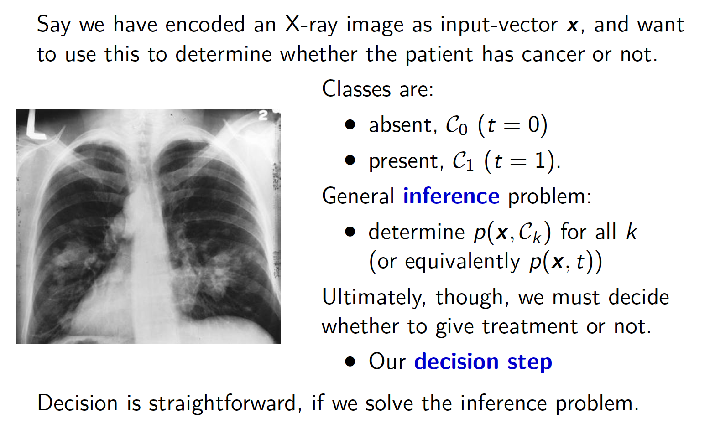
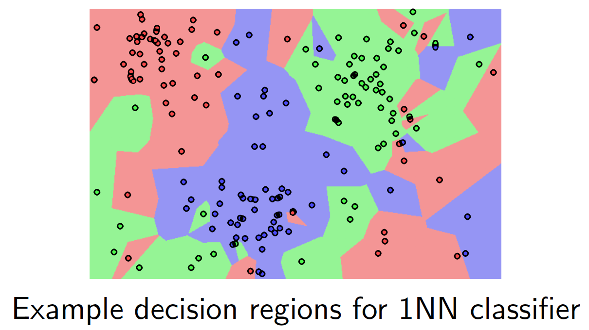
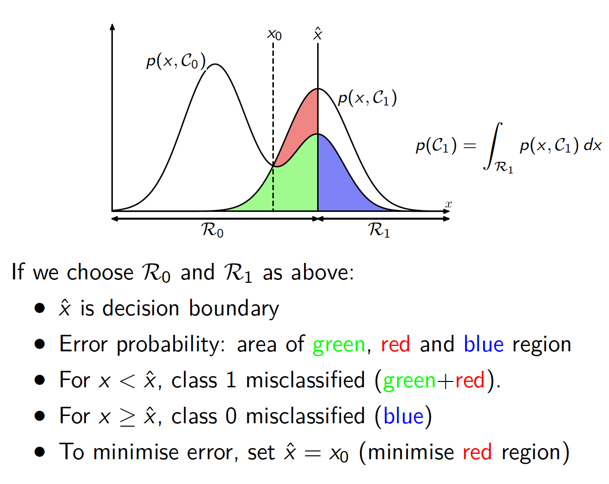
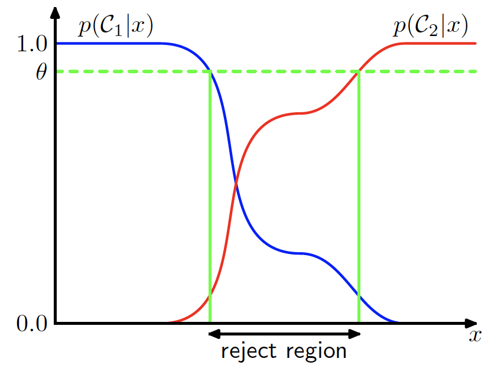
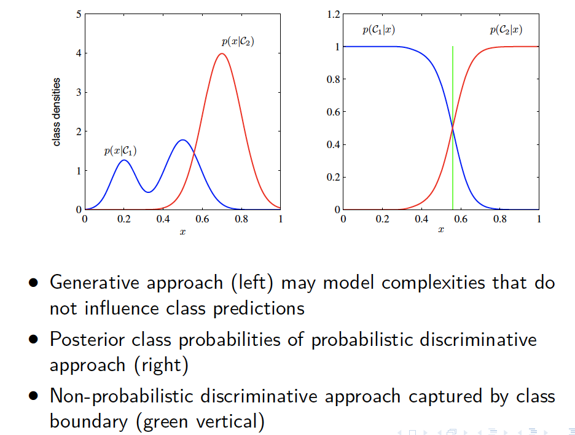

# Lecture 5: Classification, Decisions and Discriminants - 10/02/20

## 2-Class Classification

We will mainly focus on classfication between two classes $C_1$ and $C_0$. e.g. _yes_ or _no_, _true_ or _false_, _good_ or _bad_, _present_ or _absent_

Similar to regression, our data consists of vector inputs, $\bold{x} \in \R^D$ and targets $t = 1 $ for $C_1$ and $t = 0 $ for $C_0$. Can think of $t$ as the probability of class $C_1$.

>   The task is to ***learn a mapping*** $y: \R^D \to \{0,1\}$ ***that can accurately predict class for new data (unseen at training time)*** 

## 1-of-$K$ Classification

For example, predict digit from image. For more than two classes $(K \gt 2)$, convenient to define targets as a ***one-hot-vector*** - a single element 1 and all others 0, i.e., if $\bold{t}$ represents class $C_j$, then $t_j = 1$ and all other $t_k = 0$.

For example, if $K = 5$ classes, to encode class 2, we have:
$$
\bold{t} = (0,1,0,0,0)^T
$$

>   Again, we can interpret $t_k$ as the probability that the class is $C_k$

## Example: X-Ray Diagnosis

## Decision Regions and Boundaries

Given any input $\bold{x}$ we want to predict its class.

-   Need rule to assign each $bold{x}$ to an available class, $C_k$

-   Rule divides input space into ***decision regions***, $R_k$

-   Points $\bold{x} \in R_k$ assigned to $Ck$

-   ***Decision boundaries*** separate decision regions

-   Decision regions need not be connected

## Using Probabilities to Minimise Misclassification

Assume we have solved the inference problem. We are interested in the probability of class, $C_k$ , given input, $\bold{x}$ :
$$
p(C_K|\bold{x})=\frac{p(\bold{x}|C_k)p(C_k)}{p(\bold{x})}
$$

-   $p(C_k)$ is ***prior*** for class $k$
-   $p(C_k|\bold{x})$ is ***posterior*** for class $k$ given input
-   For our X-ray example:
    -   $p(C_1)$ - probability that ***typical patient has cancer***
    -   $p(C_1|\bold{x})$ - ***revised probability*** in light of the X-ray image, $\bold{x}$ 
    -   $p(C_0|\bold{x}) + p(C_1|\bold{x}) = 1$

To minise the probability of incorrect classification, we ***choose the class with the highest probability***.

For 2-classes, a misclassification occurs, when we assign input $\bold{x}$ to class $C_1$ when it should be $C_0$ (and vice versa).

-   If we pick a data-point, $\bold{x}$, at random:

$$
\begin{aligned}
p(mistake) &= p(\bold{x} \in R_0,C_1) + p(\bold{x}\in R_1,C_0) \\ 
&= \int_{R_0} p(\bold{x},C_1)d \bold{x} + \int_{R_1} p(\bold{x},C_0)d \bold{x}
\end{aligned}
$$

-   To minimise $p(mistake)$, we choose decision region so that:

$$
p(\bold{x},C_1) \gt p(\bold{x},C_0) \Longrightarrow
\bold{x}\in R_1
$$

>   Multivariate Integration:
>
>   -   Non-square region, $R$, delt with by varying bounds
>
>   $$
>   \int_R f(x,y) dx\,dy =\int_{l_x}^{u_y}\int_{l_x(y)}^{u_x(y)} f(x,y) dx \, dy
>   $$
>
>   -   Higher dimensions extend this idea

### Minimising Misclassification: 1d Example

For $K$ classes, the probability of a mistake:
$$
\begin{aligned}
p(mistake) &= \sum_k\sum_{j\ne k}p(\bold{x} \in R_j,C_k)\\
& =\sum_k \sum_{j \ne k} \int_{R_j} p(\bold{x},C_k) d\bold{x}
\end{aligned}
$$
Labels independently assigned, and so best choice for $\bold{x}$ is:
$$
y^* = \arg \max_j p(\bold{x},C_j) = \arg \max_j p(C_j|\bold{x})
$$

>   Minimum Misclassification Label for $\bold{x}$:
>   $$
>   y(\bold{x}) = \arg \max_j p(C_j|\bold{x})
>   $$

### Asymmetric Losses

In many cases, some misclassfications are less important than others. For our X-ray example:

-   false postive - classifying a healthy patient as having cancer
-   false negative - classifying cancer patient as healthy
-   Althought undesirable, false positives may have less damaginhg consequences than false negatives (or vice versa)
-   Can encode this in a ***loss matrix***, e.g.

|             | predict cancer | predict normal |
| ----------- | -------------- | -------------- |
| true cancer | 0              | 1000           |
| true normal | 1              | 0              |

### Minimising Expected Loss

Given loss matrix $L$, we wish to minise the expected loss
$$
E[L] = \sum_j \sum_k \int_{R_j}L_{kj} p (\bold{x},C_k)d\bold{x}
$$
where $L_{kj}$ is loss for predicting class $j$ for data-point from class $k$

Labels independently assigned, and so best choice for $\bold{x}$ is:
$$
y^* = \arg\max_j \sum_k L_{kj} p(\bold{x},C_k) = \arg\max_j \sum_k L_{kj} p(C_j|\bold{x})
$$

>   Minimum Expected-Loss Label for $\bold{x}$:
>   $$
>   y(\bold{x}) = \arg\min_j \sum_k L_{kj} p(C_k|\bold{x})
>   $$

### The Reject Option

Within some regions of data-space:

-   we are uncertain about class membership
-   happens where the ***largest*** $p(C_k|\bold{x})$ is ***significantly less than 1***
-   points in these regions have high classification error
-   may prefer to ***reject*** (not classify) a point when all $p(C_k|\bold{x})$ are below a threshold value

## Three Approaches

-   ***Generative Models*** - infer the joint probability $p(\bold{x},C_k)$ *(or $p(\bold{x}|C_k)$ and $p(C_k)$ separately)*, use ***Bayes Rule*** to calculate posterior class probabilities: 

$$
p(C_k|\bold{x}) = \frac{p(\bold{x}|C_k)p(C_k)}{p(\bold{x})}
$$

and then use decision theory to determine class membership

-   ***Discriminative Models (Probabilistic)*** - ***directly infer the posterior*** probabilities, $p(C_k|\bold{x})$, then use decision theory to determine class membership
-   ***Discriminative Models (Non-Probabilistic)*** - find a discriminant function $f(\bold{x})$ which ***directly maps each input, $\bold{x}$, onto a class label.***

### Generative Models:

#### Advantages:

-   We can generate synthetic data by sampling from model
-   Either learn joint distribution $p(\bold{x},C_k)$ or class-prior $p(C_k)$ and class-conditional $p(\bold{x}|C_k)$ separately
-   Can calculate the marginal density of data, $p(\bold{x})$, useful for detecting outliers in new data (poor predictive performance)

#### Disadvantages

-   Demanding in terms of data and computation, particularly if inputs, $\bold{x}$, have high dimension
-   Class conditionals may have unnessessary detail, much cheaper to compute class-posterior directly $p(C_k|\bold{x})$

#### Generative vs Discriminative 

Probabilistic discriminative models can still

-   ***minimise expected loss*** flexibly - if loss matrix changes, we do not need to relearn the full classification probram afresh
-   have a ***reject option*** - requires an estimate of the misclassification rate for each input $\bold{x} $
-   compensate for ***class prior*** - when training data has different class mixture from deployment, e.g. X-ray diagnosis classifier trained from hopsital dta, deployed at clinic
-   ***combine models*** - break into sub-problems, then combine independent predictions

## Discriminant Function

A ***discriminant*** is a function that takes input $\bold{x}$ and directly assigns it to one of $K$ classes

-   Restrict attention to linear discriminants, i.e. decision surfaces are hyperplanes
-   Do this in two stages:

$$
y(\bold{x}) = \bold{w}^T\bold{x} + w_0
$$

​		for weight vector $\bold{w}$ and bias $w_0$

-   We assign $\bold{x}$ to class C_1 if $y(\bold{x}) \ge 0 $ and to $C_0$ otherwise
-   Decision boundary defined by $y(\bold{x}) = 0$  

### Linear Discriminants, 2 Classes

### Multiple Classes: One-versus-the-rest

### Multiple Classes； One-versus-one

### A better Discriminant fro $K$-Classes

-   Define a single $K$-class discriminant from $K$ functions:

$$
y_k(\bold{x}) = \bold{w}_k^T\bold{x} +w_k0
$$

-   assign $\bold{x}$ to class $C_k$ if $y_k(\bold{x}) \gt y_j(\bold{x})$ for all $j \ne k$
-   Boundary between $R_k$ and $R_j$ given by $y_k(\bold{x}) = y_j(\bold{x})$ corresponds to $(D-1)$-dimensional hyperplane

$$
(\bold{w}_k - \bold{w}_j)^T\bold{x} + (w_{k0} - w_{j0}) = 0
$$

​		so same geometric properties as before

-   But no ambiguous regions

## Loss Functions for Discriminants

### Least Squares for Classification

Consider a general classification problem with $K$ classes

-   Each class described by separate linear model

$$
y_k(\bold{x}) = \bold{w}^T_k\bold{x} + w_{k0}
$$

-   Together this forms a vector of outputs

$$
\bold{y}(\bold{x}) = (y_1(\bold{x}),\dots,y_k(\bold{x}))^T
$$

-   Targets are one-hot vectors

$$
\bold{t}_n = (0,\dots,0,1,0,\dots,0)^T
$$

-   Least-squares minimises the average squared distance between vector prediction and vector target

$$
\sum_{n-1}^N (\bold{y}(\bold{x}_n) - \bold{t}_n)^T(\bold{y}(\bold{x}_n)-\bold{t}_n)
$$

### Problems with Least Squares

### Fisher's Linear Discriminant: Intuition

