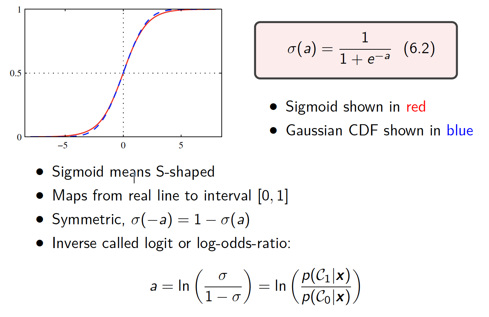
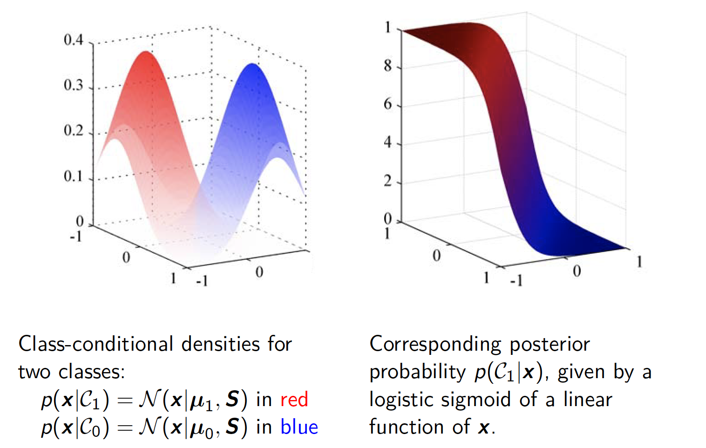
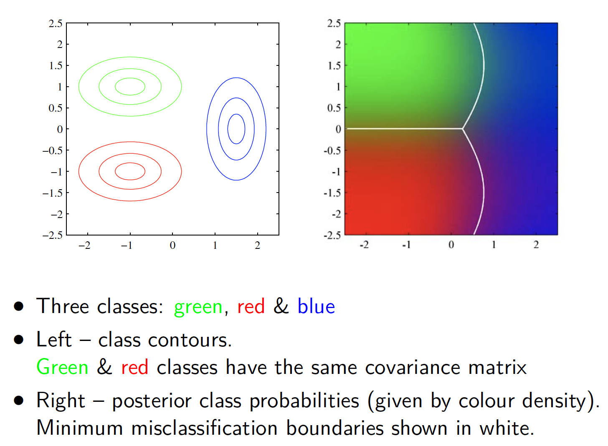
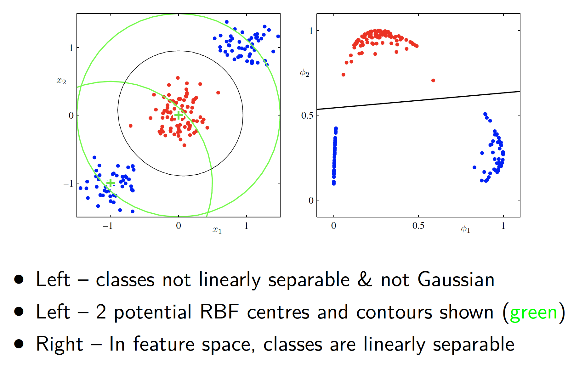
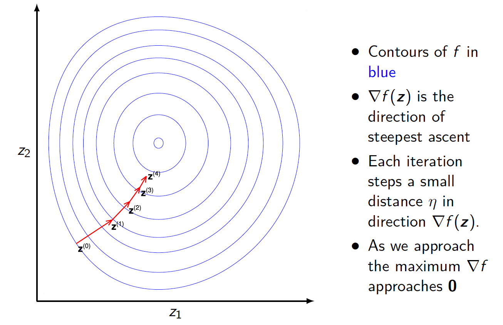
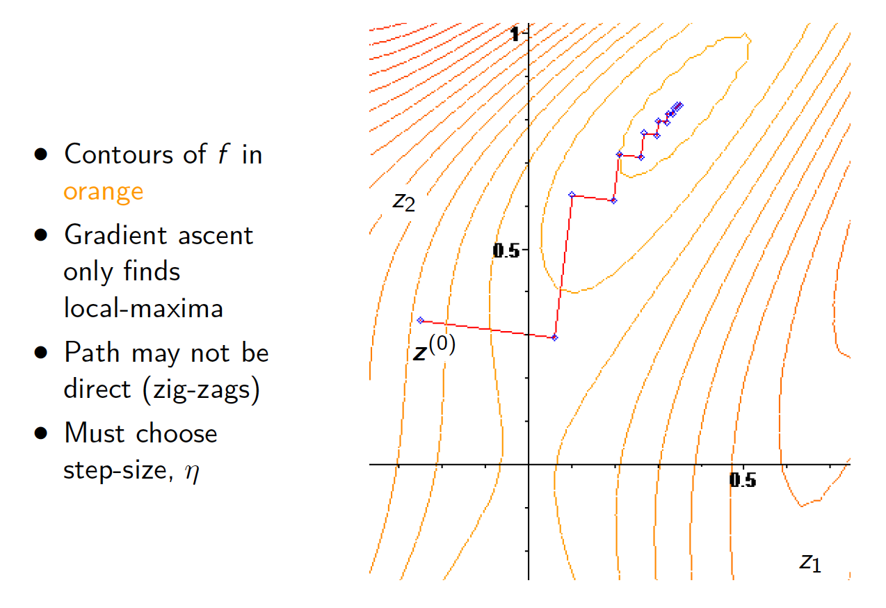
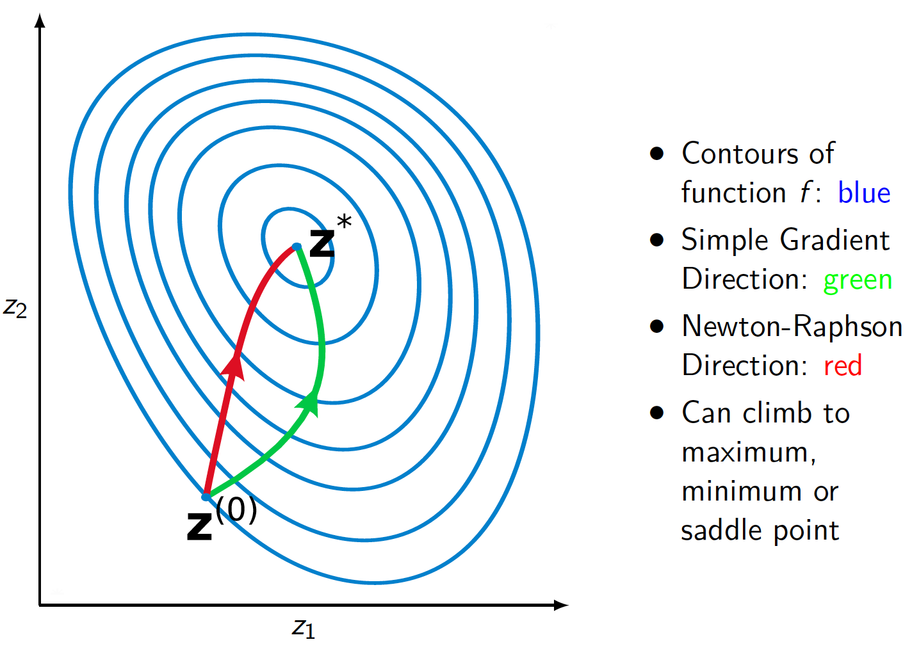
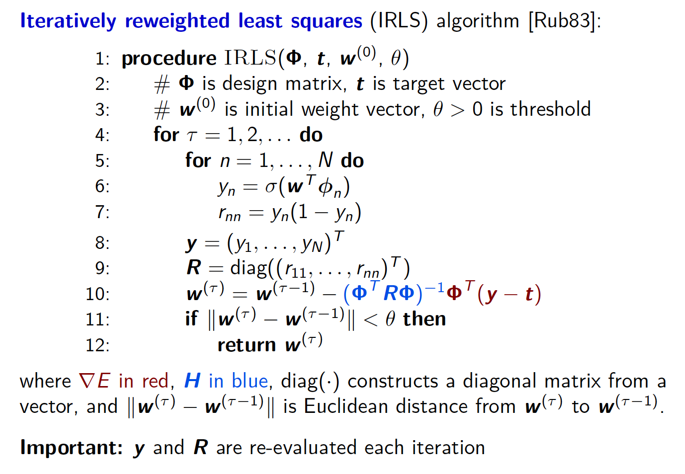

# Lecture 6: Probabilistic Classification - 24/02/20

## Generalised Linear Model

### Review: Discriminant Function

With linear regression predict real number with
$$
y(\bold{x}) = \bold{w}^T\bold{x} + w_0
$$
A 2-class linear discriminant:

-   ***Evaluates***: $y(\bold{x}) = \bold{w}^T\bold{x} + w_0$
-   ***Assigns*** $\bold{x}$ to class $C_1$ if $y(\bold{x}) \ge 0$ and to $C_0$ otherwise
-   Decision boundary defined by $y(\bold{x})=0$
-   Decision boundaries are hyperplanes

To generalise this, we want a function $y(\bold{x})$ which...

-   predicts class labels, $1,\dots,K$
-   or posterior probabilities of class labels: $p(C_k|\bold{x})$
-   e.g. for 2 -classes either $y(\bold{x}) \in \{0,1\}$ or $y(\bold{x}) \in [0,1]$

Can achieve this with ***non-linear activation function*** $f$ and
$$
y(\bold{x}) = f(\bold{w}^T\bold{x}+w_0)
$$

-   Decision boundaries are surfaces where $y(\bold{x}) = constant$, namely $(D-1)$-dimensional hyperplanes
-   So decision surfaces are linear even though $f$ is not

>   ***Generalised Linear Model***
>   $$
>   y(\bold{x}) = f(\bold{w}^T\bold{x}+w_0)
>   $$
>   for non-linear activation function $f$

-   Not lienar in the parameters (unlike linear regression models)
-   Implies more complex analytical and computational procedures
-   Nevertheless, they are still relatively simple
-   Can replace input, $\bold{x}$, with a fixed non-linear transformation to a vector of basis functions, $\Phi(\bold{x})$

## Generative Model

Consider the generative approach:

-   class-conditional densities $p(\bold{x}|C_k)$
-   class priors $p(C_k)$
-   use Bayes Theorem to compute $p(C_k|\bold{x})$
-   consider 2-classes:

$$
\begin{aligned}
p(C_1|\bold{x}) &= \frac{p(\bold{x}|C_1)p(C_1)}{p(\bold{x}|C_1)p(C_1) + p(\bold{x}|C_0)p(C_0)} \\
&= \frac{p(\bold{x}|C_1)p(C_1)}{p(\bold{x}|C_1)p(C_1) + p(\bold{x}|C_0)p(C_0)} \times \frac{p(\bold{x}|C_1)p(C_1)}{p(\bold{x}|C_1)p(C_1)}\\
&= \frac{1}{1+\frac{p(\bold{x}|C_0)p(C_0)}{p(\bold{x}|C_1)p(C_1)}\times\frac{p(\bold{x})}{p(\bold{x})}}\\
&= \frac{1}{1+\frac{p(C_1|\bold{x})}{p(C_0|\bold{x})}} \\
&=  \frac{1}{1+\exp(-a(\bold{x}))} 
\end{aligned}
$$

where $a(\bold{x}) = \ln(\frac{p(C_1|\bold{x})}{p(C_0|\bold{x})})$

## The Logistic Sigmoid

## 2-Gaussian Classes with Identical Covariance

Assume each class distribution $p(\bold{x}|C_k)$ is Gaussian with the same covariacne matrix, $\bold{S}$, then we can show
$$
p(C_1|\bold{x}) = \sigma(\bold{w}^T\bold{x}+w_0)
$$
where
$$
\begin{aligned}
\bold{w} &= \bold{S}^{-1}(\bold{\mu}_1-\bold{\mu}_0) \\
w_0 &= -\frac{1}{2}\bold{\mu}_1^T\bold{S}^{-1}\mu_1 + \frac{1}{2}\mu_0^T\bold{S}^{-1}\mu_0 + \ln \frac{p(C_1)}{p(C_0)}
\end{aligned}
$$

-   Posterior $p(C_1 | \bold{x})$ is a generalised linear function
-   Prior probabilities, $p(C_k)$ enter only through the bias term
-   Minimum misclassification decision boundary is lienar

Assume a joint distribution for input $\bold{x}_n$, class $C_k$
$$
\begin{aligned}
p(\bold{x}_n,C_1) &= p(C_1)p(\bold{x}_n|c_1) = \pi N(\bold{x}_n|\mu_1,\bold{S})\\
p(\bold{x}_n,C_0) &= p(C_0)p(\bold{x}_n|c_0) = (1-\pi) N(\bold{x}_n|\mu_0,\bold{S})\\
\end{aligned}
$$
with prior $p(C_1) = \pi$, class means $\mu_1$ & $\mu_0$, and shared covariacne $\bold{S}$

>   $$
>   p(\bold{t}|\bold{X},\pi,\mu_1,\mu_0,\bold{S}) = \prod_{n=1}^Nq_1(\bold{x}_n)^{t_n}q_0(\bold{x}_n)^{(1-t_n)}
>   $$
>
>   where
>   $$
>   \begin{aligned}
>   q_1(\bold{x}_n) &= \pi N(\bold{x}_n|\mu_1,\bold{S}) \\
>   q_0(\bold{x}_n) &= (1-\pi) N(\bold{x}_n|\mu_0,\bold{S})
>   \end{aligned}
>   $$

***Maximum Likelihood (ML) Solution*** for this model

>Class-bias and means:
>$$
>\begin{aligned}
>\pi^* &= \frac{1}{N}\sum_nt_n = \frac{N_1}{N_1 + N_0} \\
>\bold{\mu_1}^* &= \frac{1}{N_1}\sum_nt_n\bold{x}_n \\
>\bold{\mu_0}^* &= \frac{1}{N_0}\sum_n(1-t_n)\bold{x}_n
>\end{aligned}
>$$

-   $N_k$ is number of points of class $k$
-   Class bias, $\pi$, is the fraction of positive data-points
-   Class-means are simply the means of each classes data-points

>   Covariane:
>   $$
>   \bold{S}^* = \frac{N_1}{N}\bold{S}_1 + \frac{N_0}{N}\bold{S}_0
>   $$
>   where $\bold{S}_1 = \frac{1}{N_1}\sum_n t_n(\bold{x}_n - \mu_1)(\bold{x}  - \mu_1)^T$ and $\bold{S}_0 = \frac{1}{N_0}\sum_n (1 - t_n)(\bold{x}_n - \mu_0)(\bold{x}  - \mu_0)^T$

-   Covariance is the weighted sum of the class covariance
-   Shared covariance assumed
-   But it takes $\frac{D(D+1)}{2}$ computations for 2-class and $k\frac{D(D+2)}{2}$ for $k$-class, the time complexity is $O(D^2)$

## The Soft-Max

>   For $K$-classes:
>   $$
>   \begin{aligned}
>   p(C_k | \bold{x}) &= \frac{p(\bold{x}|C_k)p(C_k)}{\sum_{j=1}^K p(\bold{x}|C_j)p(C_j)} \\
>   &= \frac{\exp(a_k)}{\sum_{j=1}^{K} \exp(a_j)}
>   \end{aligned}
>   $$

A normalised exponential: a natural extention to the logistic sigmoid, and where $a_k = \ln p(\bold{x}|C_k)p(C_k)$

Normalised exponential is sometimes called ***soft-max***, because:

-   If $a_k \gg a_j $ for all $j \ne k$
-   then $p(C_k | \bold{x}) \simeq 1$ and $p(C_j|\bold{x}) \simeq 0$  

For $K$-classes all with the same covariance matrix:
$$
a_k = \bold{w}^T_k\bold{x} + w_{k0}
$$
where $\bold{w}_k = \bold{S}^{-1}\mu_k$ and $w_{k0} = -\frac{1}{2}\mu_k^T\bold{S}^{-1}\mu_k + \ln p(C_k)$

-   terms $a_k$ again linear in $x$
-   minimum misclassification boundaris again linear

*If each class has an **independent covariance matrix***

-   *$a_k$ is quadratic in $\bold{x}$*
-   *Gives rise to quadratic discriminant with quadratic decision boundaries*

## A Discriminative Approach

Recall that we can directly learn posterior class probabilities $p(C_k|\bold{x})$, for classification:

-   useful when complexities in $p(\bold{x}|C_k)$ do not (or only weakly) influence classification task
-   or if no good distributional form for each $p(\bold{x}|C_k)$

We take inspiration from:

-   2-Classes with Gaussian densities and $\bold{\Sigma}_1 = \bold{\Sigma}_2$ leads to:
    $$
    p(C_1 | \bold{x}) = \sigma(\bold{w}^T\bold{x}+w_0)
    $$
    

-   Logistic sigmoid of quadratic functions when $\Sigma_1 \ne \Sigma_0$

So why not instead, directly define a probabilistic discriminant using the logistic sigmoid?

-   Typically this has fewer parameters to fit
-   Can improve performance, if generative assumptions lead to poor approximations (e.g. classes not Gaussian)
-   As with linear regression,  we can use fixed basis functions:

$$
\phi(\bold{x}) = (\phi_0(\bold{x}),\phi_1(\bold{x}),\dots,\phi_{M-1}(\bold{x}))
$$

with $\phi_0(\bold{x}) = 1$

-   No closed form solution, but iterative approach exist

## Logistic Regression

Consider just 2-classes and fixed basis function $\phi$:

-   Posterior probability of $C_1$ written as:

$$
p(C_1 | \bold{x}) = \sigma(\bold{w}^T\phi(\bold{x}))
$$

(No separate bias term, as $\phi(\bold{x}) = 1$)

-   Using logistic sigmoid:

$$
\sigma(a) = \frac{1}{1+e^{-a}}
$$

-   For $M$ basis functions, we have $M$-parameters (elements of $\bold{w} $)
-   Comparisiom: to fit our generative model our paramters would comprise: $2M$ for the means, $\frac{M(M+1)}{2}$ for shared covariance and 1 for class bias

## Discriminative Likelihood and Related Error

For data-points ($\phi_n,t_n$) where $t_n \in \{0,1\}$ and $\phi_n = \phi(\bold{x}_n)$ for $n = 1, \dots, N$ our discriminative model has likelihood:
$$
p(\bold{t}|\bold{w}) = \prod_{n=1}^{N} y_n^{t_n}(1-y_n)^{1-t_n}
$$
for $\bold{t} = (t_1, \dots, t_N)^T$ and $y_n = p(C_1|\phi_n) = \sigma(\bold{w}^T\phi_n)$

As with regression, take negative log likelihood as error function:

>   ***The Cross-Entrophy Error Function***
>   $$
>   \begin{aligned}
>   E(\bold{w}) &= - \ln p(\bold{t}|\bold{w}) \\
>   &= - \sum_{n=1}^N(t_n \ln y_n + (1-t_n) \ln(1-y_n))
>   \end{aligned}
>   $$

Take gradient to minimise the error:
$$
\begin{aligned}
\nabla_\bold{w} E(\bold{w}) &= \sum_{n=1}^{N}(\sigma(\bold{w}^T\bold{\Phi}_n) - t_n) \bold{\Phi}_n \\
 &= \bold{\Phi}(\bold{y} - \bold{t})
 \end{aligned}
$$
with design-matrix, $\bold{\Phi}$, targets $\bold{t} = (t_1, \dots, t_n)^T$, predictions $y_n = \sigma(\bold{w}^T\phi_n)$ and prediction vector $\bold{y} = (y_1, \dots, y_N)^T$

*Unfortunately, the non-linear form means we cannot simply set to zero and rearrange*

## Gradient Ascent Methods

We want to find the maximum of function $f: \R^D \to \R$, and we can calculate the gradient $\nabla f = \nabla_\bold{z}f$ for any point $\bold{z}$

***Recipe***:

-   Choose an initial exstimate $\bold{z}^{(0)}$ (possibly randomly)
-   Repeatedly ipdate estimate with:

$$
\bold{z}^{(\tau+1)} = \bold{z}^\tau + \eta \nabla f
$$

where $\eta \gt 0$ is a small step size and $\nabla f$ is evaluated at $\bold{z}^{(\tau)}$

-   Stop when magnitude of $\nabla f$ falls below a thredhold
-   Eventualy reachs a local maximum, if $\eta$ small enough

### Problem

## Newton-Raphson Method

Consider a univariate function $f:\R \to \R$ which is twice differentiable. Define $f_\tau$, the second order Taylor expansion of $f$ around point $x^{(\tau)}$:
$$
\begin{aligned}
f(x) \approx f_\tau (x) &= f_\tau (x^{(\tau)}+u_\tau) \\
&= f(x^{(\tau)}) + f'(x^{(\tau)})u_x  + \frac{1}{2}f''(x^{(\tau)})u_\tau^2
\end{aligned}
$$
where $u_\tau = x-x^{(\tau)}$ 

$u_\tau$ Maximises/minimises this expression when:
$$
\frac{d}{du_\tau}(f_\tau(x^{(\tau)}+u_\tau)) = f'(x^{(\tau)}) + f''(x^{(\tau)})u_\tau = 0 \\
\Longrightarrow u_\tau = -\frac{f'(x^{(\tau)})}{f''(x^{(\tau)})}
$$

>   ***Message***: can use second order derivatives to climb functions more quickly

We seek the maximum of function $f: \R^D \to \R$, and can calculate gradient $\nabla_zf$ and Hessian $\bold{H}(\bold{z})  = \nabla \nabla f = \nabla^2 f$ for any $\bold{z}$.

The Hessian is the matrix of second derivatives evaluatied at $\bold{z}$:
$$
[\bold{H}(\bold{z})]_{ij} = \frac{\partial^2f}{\partial z_i \partial z_j} |_\bold{z}
$$

$$
\bold{H}(\bold{z}) = 
\begin{pmatrix}
\frac{\partial^2 f}{\partial z_1^2} & \frac{\partial^2 f}{\partial z_1 \partial z_2} & \dots & \frac{\partial^2 f}{\partial z_1 \partial z_n} \\
\frac{\partial^2 f}{\partial z_2 \partial z_1} & \frac{\partial^2 f}{\partial z_2 \partial z_2} & \dots & \frac{\partial^2 f}{\partial z_2 \partial z_n} \\
\vdots & \vdots & \ddots & \vdots \\
\frac{\partial^2 f}{\partial z_n \partial z_1} & \frac{\partial^2 f}{\partial z_n \partial z_2} & \dots & \frac{\partial^2 f}{\partial z_n^2} \\
\end{pmatrix}
$$

***Recipe***:

-   Choose an initial estimate $\bold{z}^{(0)}$ (possibly randomly)
-   Repeatedly update estimate with:

$$
\bold{z}^{(\tau +1)} = \bold{z}^{(\tau)} - \bold{H}^{-1}\nabla f
$$

where $\nabla f$  and $\bold{H} $ are evaluated at $\bold{z}^{(\tau)}$

-   Stop when magnitude of $\bold{H}^{-1}\nabla f$ falls below a threshold

## Linear Regression with Newton-Raphson Method

Apply the ***Newton-Raphson Method*** to Linear Regression model:
$$
\begin{aligned}
E(\bold{w}) &= \frac{1}{2} (\bold{t} - \bold{\Phi}\bold{w})^T(\bold{t} - \bold{\Phi}\bold{w}) \\
\nabla E(\bold{w}) &= \bold{\Phi}^T\bold{\Phi}\bold{w} - \bold{\Phi}^T\bold{w} \\
\bold{H}(\bold{w}) &= \nabla^2E(\bold{w}) = \bold{\Phi}^T\bold{\Phi}
\end{aligned}
$$
Iterative function:
$$
\begin{aligned}
\bold{w}^{(new)} &= \bold{w}^{(old)} - (\bold{\Phi}^T\bold{\Phi)^{-1}(\Phi}^T\bold{\Phi}\bold{w}^{(old)}-\bold{\Phi}^T\bold{t}) \\
&= (\bold{\Phi}^T\bold{\Phi})^{-1}\bold{\Phi}^T\bold{t} \\
&= \bold{w}_{ML}
\end{aligned}
$$
*We get the maximum in a **single step** for any $\bold{w}^{(old)}$*

## Logistic Regression with Newton-Raphson Method

For Logistic Regression, we seek to minimise ***cross-entropy error***:
$$
\begin{aligned}
E(\bold{w}) &= - \sum_{n=1}^N(t_n \ln y_n + (1-t_n) \ln(1-y_n)) \\
\nabla E(\bold{w}) &= \bold{\Phi}(\bold{y} - \bold{t})
\end{aligned}
$$
with design-matrix, $\bold{\Phi}$, targets $\bold{t} = (t_1, \dots, t_N)^T$, predictions $y_n = \sigma(\bold{w}^T\phi_n)$ and prediction vector $\bold{y} = (y_1, \dots, y_N)^T$

Hessian Matrix:
$$
\bold{H} = \nabla \nabla E(\bold{w}) = \sum_{n=1}^Ny_n(1-y_n)\bold{\Phi}_n^T\bold{\Phi}_n = \bold{\Phi}^T\bold{R}\bold{\Phi}
$$
Where $\bold{R} \in \R^{N \times N}$ is a diagonal matrix with non-zero elements:
$$
[\bold{R}]_{nn} = y_n(1-y_n)
$$

### Algorithm

