# Lecture 7: Reinforcement Learning 1: Dynamic Programming & Monte-Carlo Estimation - 02/03/20

## Reinforcement Learning

-   ***Supervised Learning*** - map inputs to outputs, learn some *hidden functions* with some *training dataset* where labels are given
-   ***Reinforcement Learning*** - act within an environment to achieve goals
-   ***Unsupervised Learning*** - discover patterns in unlabelled data

## Agent-Environment Interaction

At time $t$:

-   Assume environment is in state $S_t$
-   Agent perceives $S_t$ and chooses action $A_t$
-   Environmmet transitions to state $S_{t+1}$
-   Agent gets reward $R_{t+1}$ and perceives $S_{t+1}$


```sequence
Environment->Agent: State: $S_t$
Agent->Environment: Action: $A_t$
Note left of Environment: State: $S{t+1}$
Environment->Agent: State: $S_{t+1}$
Environment->Agent: Reward: $R_{t+1}$

```

## Causal Relationships: States, Actions & Rewards

-   $S_t$ is state at time $t$
-   Agent then takes action $A_t$
-   System transitions to state $S_{t+1}$
-   Transition gives reward $R_{t+1}$. *Some prefer to think of costs (negative rewards)*

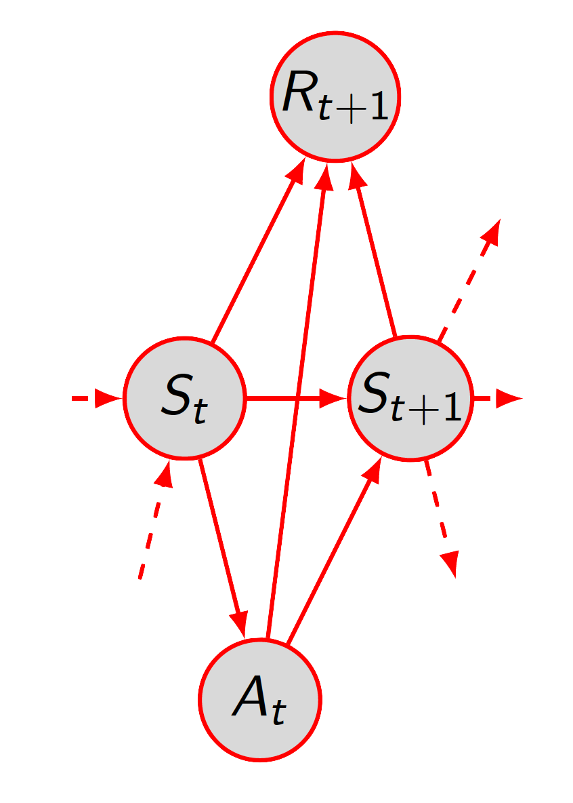

*Subsequent reward, state and action depend on previous steps*

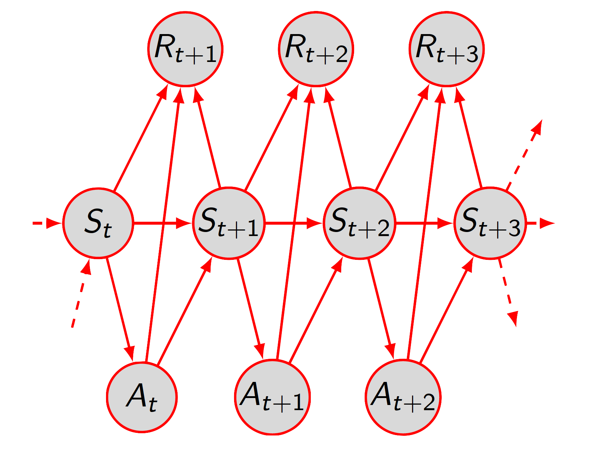

>   ***Markov Property*** (the *Markov Assumption*):
>   $$
>   p(s_{t+1},r_{t+1}|s_t,a_t,s_{t-1},a_{a-1},\dots,s_0) = p(s_{t+1},r_{t+1}|s_t,a_t)
>   $$

## Example: The Coffee Problem

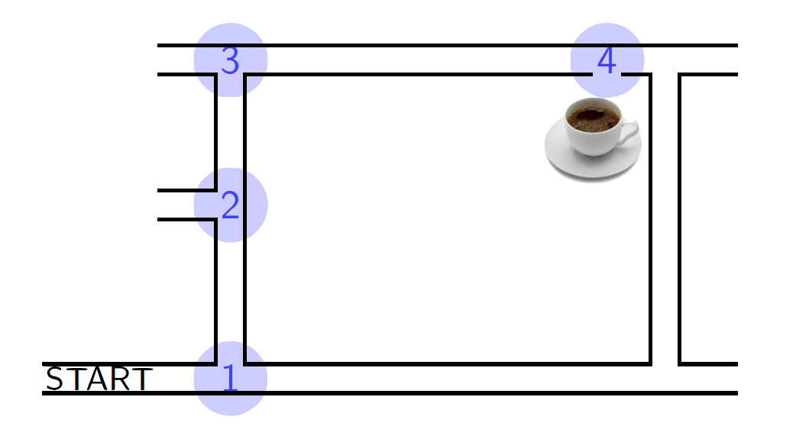

The ***states*** are: $S =\{1,2,3,4\}$

***Policy*** for this task:
$$
\pi(1) \implies turn \, left \\
\pi(2) \implies straight \, on \\
\pi(3) \implies turn \, right \\
\pi(4) \implies go \, through \, door \\
$$
The ***probabilistic policy***:
$$
\pi(s,a) = p(A_t = a|S_t = s)
$$

## Summary of Markov Decision Process

>   A ***Markov Decision Process*** (*MDP*) is comprised of:
>
>   -   Set of states: $S$
>   -   Set of actions: $A$
>   -   Transition function: $t(s,a,s') = p(s'|s,a)$
>   -   Reward function: $r(s,a,s')$ for transition $(s,a) \to s'$
>   -   Initial distribution: $p_0(S_0 = s)$

Markov Decision Processes describe ***a class of control problems***.

To integrate with a MDP, we also must define a ***policy***: $\pi$

-   can be ***deterministic***, e.g. $\pi(s) = a$
-   or ***probabilistic***, e.g. $\pi(s,a) = p(a|s,\pi)$

## The Problem

Question: ***How do we find the best policy for our MDP?***

-   Need to score (or rank) policies, better score implies better policy
-   Define ***"better"***?

## The Solution

-   Define ***return*** - performance measure for time-line of reward
-   Estimate ***expected return*** given current state (or state-action)
-   Choose actions that <u>maximise</u> ***expected return***

## Traces, Return and Values

***Traces*** capture potential event sequences in our domain

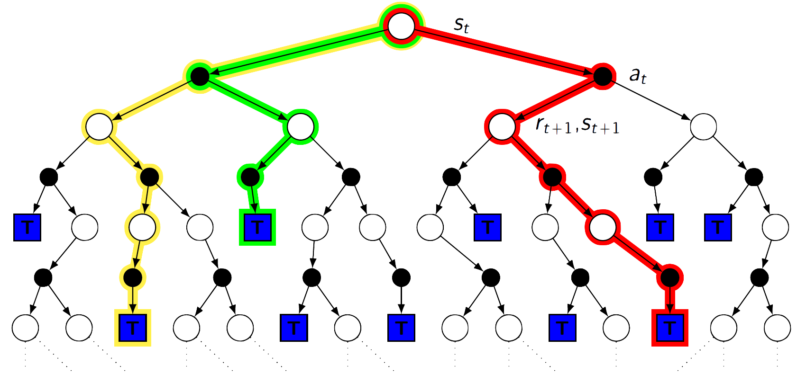

>   *Legend*:
>
>   -   White nodes are ***states***
>   -   Black nodes are available ***actions*** at that state
>   -   Coloured paths are  ***traces***
>   -   T boxes are ***terminal states***

***Trace*** - a ***state-action-reward*** sequence:
$$
\tau = S_0, A_0, R_1, A_1, R_2, \dots, R_N,S_N (= \tau_{[0:N]})
$$
***Return*** - score for trace, $\tau$
$$
G(\tau) = \sum_{k=0}^{N-1} \gamma_kR_{k+1}
$$
Where $\gamma_k$ is some ***scaling*** or ***discount factors***. Common choices for discount factors:

-   A simple sum: $\gamma_k = 1$
-   Average reward: $\gamma_k = \frac{1}{N}$
-   ***Geometric discount***, $\gamma_k = \gamma^k$, with $0 \lt \gamma \lt 1$

Typically we know $\tau$ and write:
$$
G_t = \sum_{k=t}^{N-1}\gamma_kR_{k+1}
$$

>   ***Expected Return*** predicts average return for policy $\pi$:
>   $$
>   J(\pi) = \mathbb{E}_{\pi} [\sum_{k=0}^\infty\gamma^kR_{k+1}]
>   $$
>   *It scores **a policy***

>   ***Value Function*** (*"State Value Function"*) assigns values to states:
>   $$
>   v^{\pi}(s) = \mathbb{E}_{\pi}[\sum_{k=0}^\infty \gamma^kR_{t+k+1}|S_t = s]
>   $$
>   *It scores **a policy given a state***

>   $Q$-***Function*** (*"State Action Value Function"*) assigns state-action values:
>   $$
>   q^\pi(s,a) = \mathbb{E}_\pi[\sum_{k=0}^\infty\gamma^kR_{t+k+1}|S_t = s, A_t = a]
>   $$
>   *It scores **a policy given a state and an action***

## Brute Force Estimates

A naive way to estimate $v^\pi(s)$ or $q^\pi(s,a)$: consider all traces

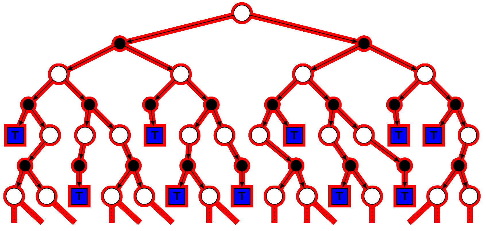

Calculate a weighted sum over all possible traces:

***Expected Return***:
$$
\begin{aligned}
J(\pi) &= \mathbb{E}_\pi [\sum_{k=0}^\infty\gamma^kR_{k+1}] \\
&= \sum_\tau p(\tau|\pi)G(\tau)
\end{aligned}
$$

>   ***Note that***:
>
>   The expectations have a subscript $\pi$ indicating that the random action are sampled from the policy $\pi$. This could be more fully written as:
>   $$
>   J(\pi) = \mathbb{E}_{\pi,t,p_0} [\sum_{k=0}^\infty\gamma^kR_{k+1}]
>   $$
>   To indicate that the initial state is sampled from $p_0$ and subsequent states from the transition probabilities described in $t$. 

***Value Function***:
$$
\begin{aligned}
v^{\pi}(s) &= \mathbb{E}_{\pi}[\sum_{k=0}^\infty \gamma^kR_{t+k+1}|S_t = s] \\
&= \sum_\tau p(\tau|\pi,S_0 = s)G(\tau)
\end{aligned}
$$

>   ***Note that***:
>
>   Similarly, the value function could be more fully written as:
>   $$
>   v^{\pi}(s) = \mathbb{E}_{\pi,t}[\sum_{k=0}^\infty \gamma^kR_{t+k+1}|S_t = s]
>   $$
>   As the MDP tends to be a fixed but the policy varying, we drop the additional subscripts

>   ***However***: The number of traces is ***exponential***, making the solution ***expensive*** and ***not feasible***

## A Smarter Way

Write ***value*** at this state, $s$: $V(s),$ in terms of:

-   The <u>probability</u> that ***we choose each action*** $a$: $\pi(s,a)$
-   The <u>probability</u> that ***we transition to the next state given that*** $a$: $t(s,a,s')$
-   <u>Something about</u> the ***reward*** that we would expect ***if we follow that arc*** $s'$: $r$
-   And our <u>subsequent value</u> in that ***state*** $s'$: $V(s')$

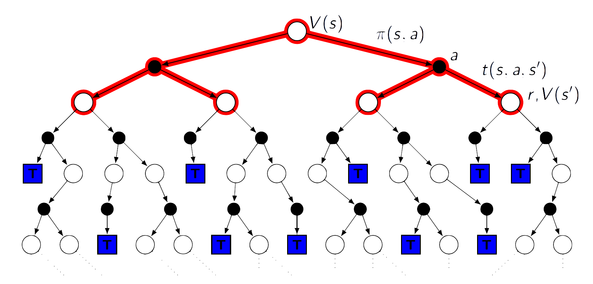

>   ***Note that***: So that we can write the value of a state in terms of the value of another state, which is a ***recursive definition***

Using the ***Markov Property*** we can rewrite $v^\pi$
$$
\begin{aligned}
v^\pi(s) &= \mathbb{E}_\pi[\sum_{k=0}^\infty \gamma^kR_{t+k+1}|S_t = s] \\
&= \mathbb{E}_\pi[\gamma^0R_{t+1} + \sum_{k=1}^\infty \gamma^kR_{t+k+1}|S_t = s] \\
&= \mathbb{E}_\pi[R_{t+1}+\gamma\sum_{k=1}^\infty \gamma^{k-1}R_{t+k+1}|S_t = s] \\
&= \mathbb{E}_\pi[R_{t+1} + \gamma \sum_{k=0}^\infty \gamma^kR_{(t+1)+k+1}|S_t = s] \\
&= \mathbb{E}_\pi[R_{t+1} + \gamma v^\pi(S_{t+1})|S_t = s] \\
&= \sum_a \pi(s,a) \sum_{s'} t(s,a,s')(r(s,a,s')+\gamma v^\pi(s'))
\end{aligned}
$$
Where:

-   $\sum_a \pi(s,a)$ is the sum over all the possible action we can take in this state and each term is multiplied by the probability of choosing that action given $s$
-   Given that we've chosen an action, $\sum_{s'} t(s,a,s')$ is the sum over the state $s'$ and each term is multiplied by the probability of transitioning to that state given $s$ and $a$
-   And all multiplied by the reward we get from that transition $r(s,a,s')$, plus $\gamma$ times the value of being in that state $v^\pi(s')$

>   Sometimes called the ***Bellman Equation for fixed*** $\pi $. We don't need to concern the state before $t$

## "Stair Climing" Markov Decision Process

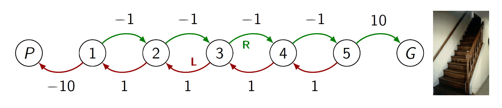

>   *Legend*:
>
>   The nodes are states, $P$ is "penalty" and $G$ is "goal"

Objective: ***Learn how to maximise our return this in process.***

Start state is $3$, states $P$ and $G$ are absorbing. $\gamma = 0.9$

-   Begin with the unbiased random policy, i.e. for all states $s$, $\pi(s,L) = \pi(s,R) = \frac{1}{2}$
-   We want to evaluate the value, $v^\pi(s)$, at each state $s$

### Estimating $v^\pi$ for some MDP 

-   Begin with estimates $\hat{v}(s) = 0$ for all $s$

>   $\hat{v}$ is used to represent an estimate of $v^\pi $

-    Using update based on the ***Bellaman Equation*** for all $s$,

$$
\hat{v}'(s) \gets \sum_a \pi(s,a) \sum_{s'} t(s,a,s')(r(s,a,s')+\gamma \hat{v}^\pi(s'))
$$

-   Each update ***improves*** our estimates
-   Repeat the update until ***sufficiently accurate*** 

### Algorithm

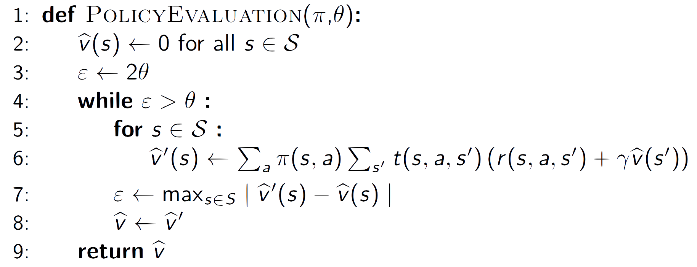

### Policy Evaluation

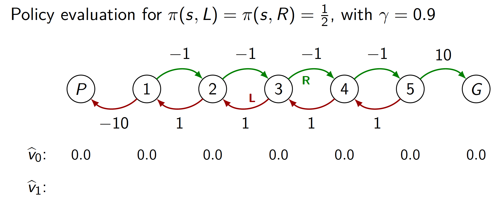

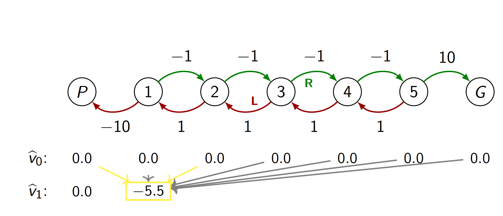

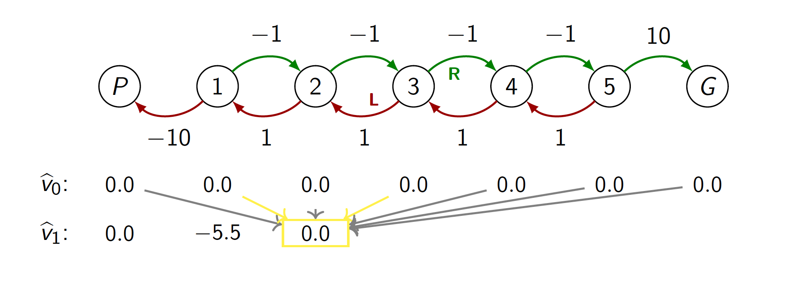

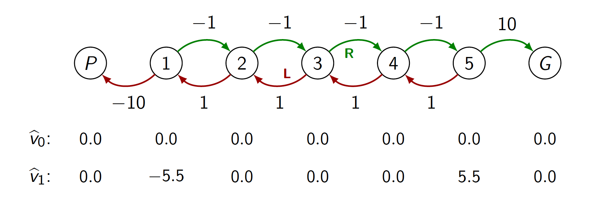

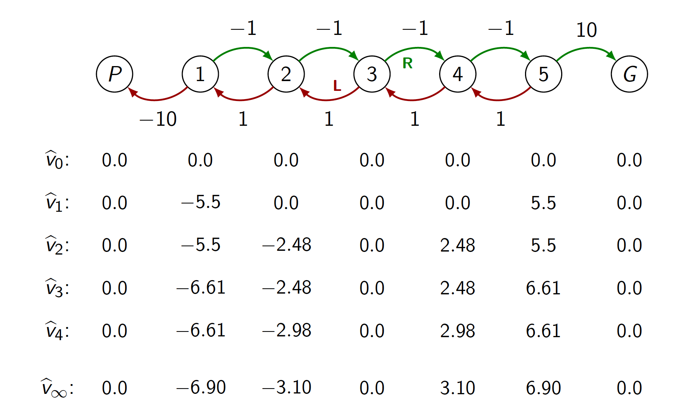

-   Estimate value function, i.e. $\forall s, \hat{v} (s)\approx v^\pi(s)$
-   Requires direct access to transition probabilities and reward function
-   Requires the Markov Property
-   Can use any initial values for $\hat{v}_0$
-   Can be performed ***in-place***, using one copy of $\hat{v}$, with slight performance gain

### Algorithm (in-place)

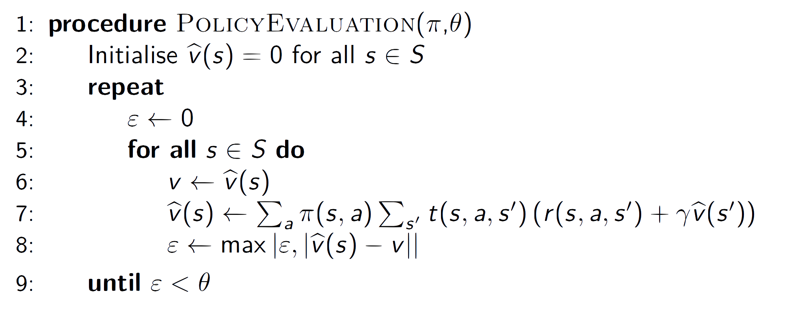

## Using $\hat{v}$: A Grid World Example

## 

-   Actions: $N,E,S,W$
-   Action effects are ***deterministic***
-   $(0,0)$ and $(3,3)$ are ***absorbing (goal) state***
-   $R_{t+1} = -1$ (all transitions)
-   $\pi(s,a) = \frac{1}{4}$, for all $s$ and $a$ (unbiased random policy)

*Finding the path to absorbing states with the lowest cost, which means the shortest path.*

### Policy Evaluation


### Policy Improvement

Given $\hat{v}$, can ***greedily*** choose better (deterministic) policy, $\pi'$, where:
$$
\begin{aligned}
\pi' &= \arg\max_a \mathbb{E}(r_{t+1} + \gamma\hat{v}(s_{t+1})|s_t = s, a_t = a) \\
&= \arg \max_a \sum_{s'} t(s,a,s')(r(s,a,s')+\gamma\hat{v}(s')) \\
\end{aligned}
$$
***Policy Iteration***: 

Alternate between policy evaluation step, $E$, and policy improvement step, $I$, until the policy is evaluated to a value function which does not suggest any changes to that policy, which is a stationary point indicating optimal policy.
$$
\pi_0\xrightarrow{E}v^{\pi_0}\xrightarrow{I}\pi_1\xrightarrow{E}v^{\pi_1}\xrightarrow{I}\pi_2\xrightarrow{E}\dots\xrightarrow{I}\pi^*\xrightarrow{E}v^*
$$

>   ***Policy Iteration*** can be thought of as a cycle of repeated steps involving first policy evaluation and then policy improvement. Once the policy converges on the optimal policy, the policy improvement step does not change the policy. Consequently, the policy evaluation step leads to the same values.
>
>   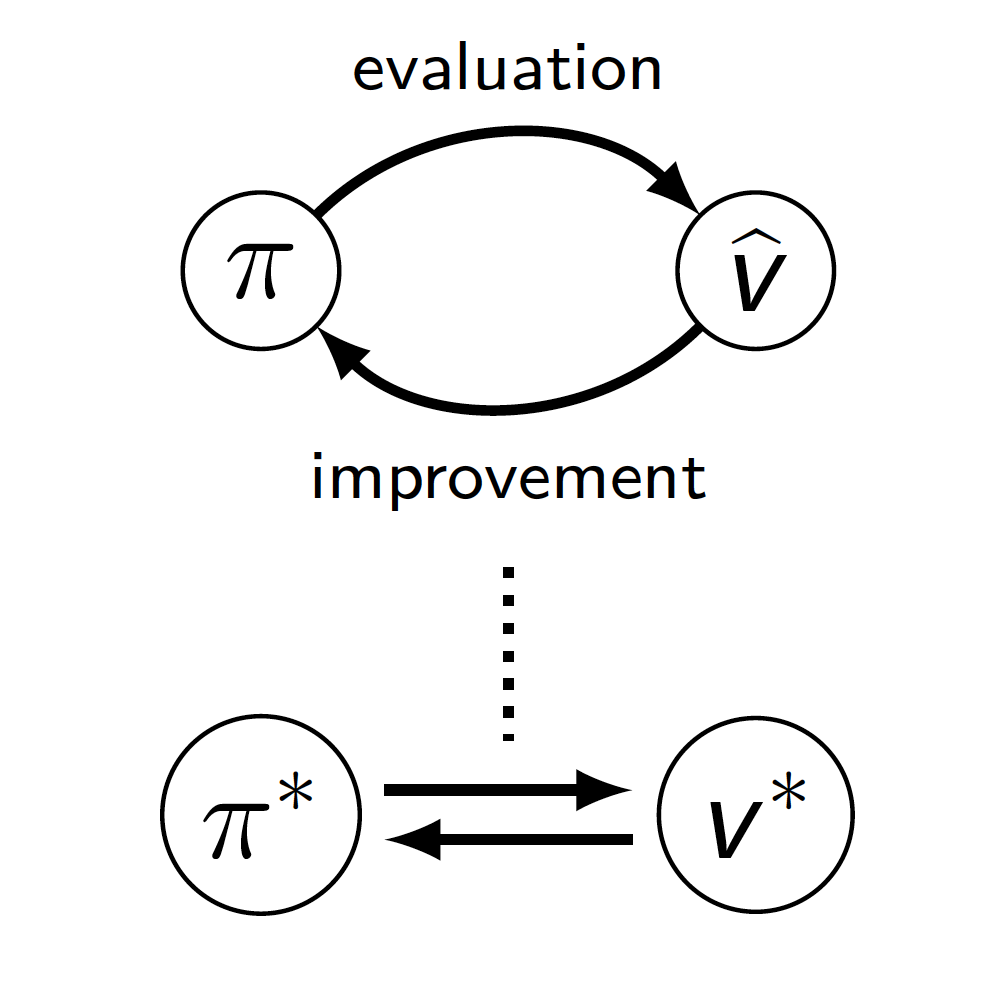

### Algorithm

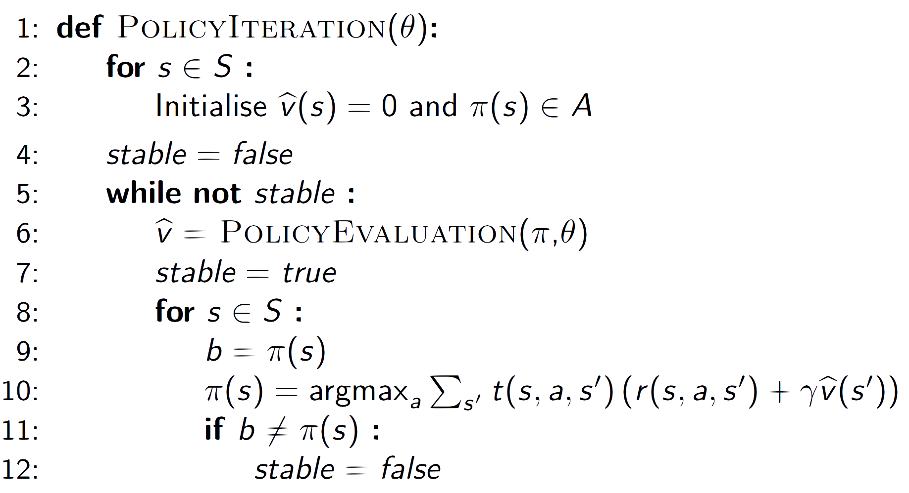

 ###  Value Iteration and Algorithm

***Value Iteration*** combines policy evaluation and improvement in a single step for improved efficiency. 

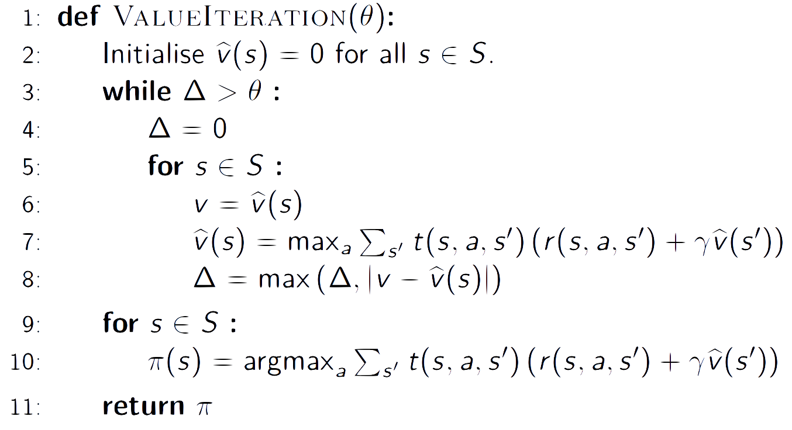

## Function Approximation

Till now we've considered ***table-lookup*** value functions (*a table of states and associated values*). We are estimating the value of our states which estimate the expected discounted return from state $s$ following policy $\pi$ until we reach some terminal state. We are estimating $v^\pi (s)$ independently. But that is not the most efficient way to catch a value function. 

Imagine instead that the value function is approximated by:
$$
\hat{v}(s;\bold{w})\approx v^\pi(s)
$$
for some paramters $\bold{w}$

***Linear Value Function Approximation***

For each $s \in S, \phi(s) \in \R^D$
$$
\hat{v}(s;w) = \bold{w}^T\phi(s)
$$


***Strength***: similar states can have similar values, no longer restricted to finite state space.

### Features: Special Case

Possible to see table lookup as a special case of linear function approximation.

Consider $\phi : S \to \R^{|S|}$ and $j\in S \sub \N $

Make $\phi(j)$ a one-hot vector with $\phi_j(j) = 1$:
$$
\hat{v}(j;\bold{w}) = \bold{w}^T\phi(j) = w_j
$$
And we can independently estimate each $w_j \approx v^\pi (j)$, just as in table look up. We have as many weights as we have states.

### Examples of Features

Consider a grid world with obstacles.

Features, we might choose:

-   The $(x,y)$ coordinate of the agent
-   Overlapping sets of tiling: each tile has index $j$ and:
    -   $\phi(j) = 1$ if agent inside tile $j$
    -   $\phi(j) = 0$ otherwise
-    Based on accessibility of neighbour cells, either:
    -   each of the 256 unique situations, as one hot vectors
    -   binary vector, $\phi(S) \in \{0,1\}^8$

Or any feature mapping, e.g. RBF/polynomial, applied to the above features.

#### Example: Tile

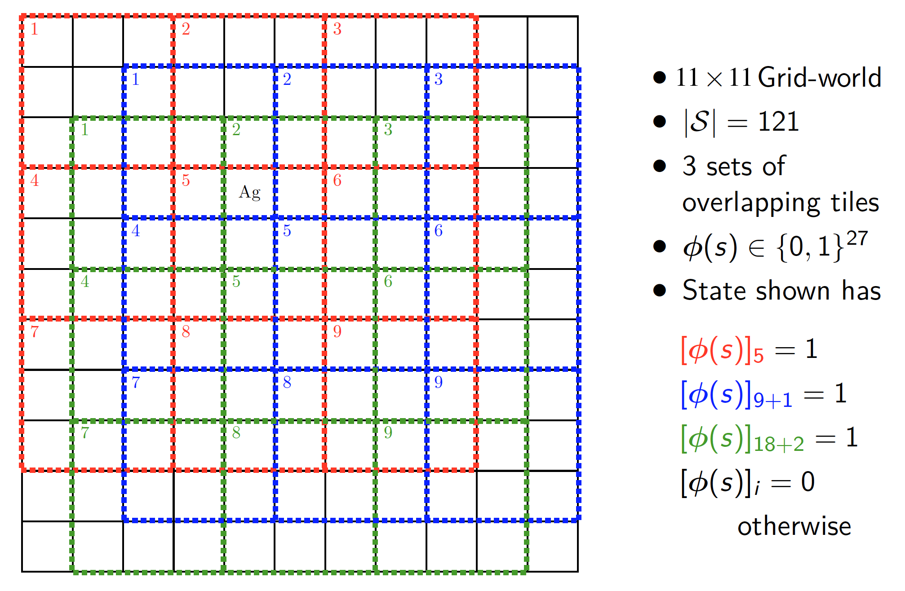

#### Example: Neighbours

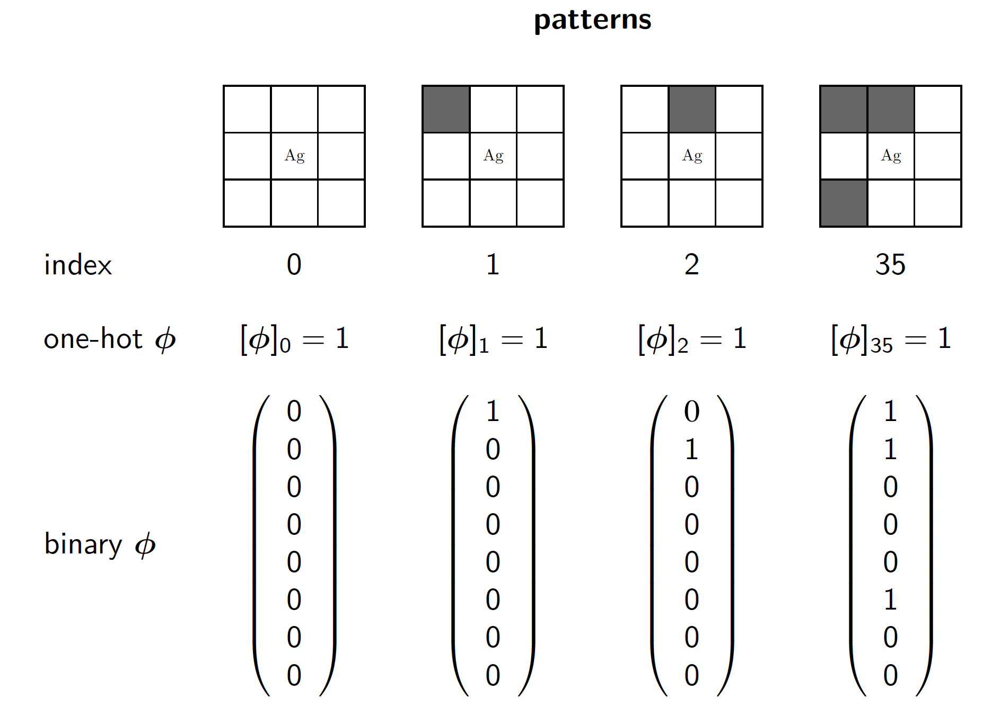

### Issues Arising

In most non-trivial cases:

-   Problem is potentially no longer Markow
    $$
    p(\phi(s_{t+1}),r_{t+1}|\phi(s_t),a_t,\phi(s_{t-1}),a_{t-1},\dots,\phi(s_0)) \ne p(\phi(s_t+1),r_{t+1}|\phi(s_t),a_t)
    $$
    The probability of some features and some rewards given some history of features and actions ***cannot ignore*** that history.

-    Expressibility of $\hat{v}(s;\bold{w})$ limited

    e.g. if $\phi(s) \approx \phi(s')$ then $\hat{v}(s;\bold{w}) \approx \hat{v}(s';\bold{w})$

-   $\hat{v}(s;\bold{w})$ and $\hat{v}(s';\bold{w})$ no longer independently optimised

## Proposed Error Function

To address the issues, consider an ***error function***, which is the ***expectation*** under $\pi$ of the squared difference between ***true value function*** at $S$, $v^\pi(S)$, and the ***estimated value function*** at $S$, $\hat{v}(S;\bold{w})$:
$$
E(\bold{w}) = \frac{1}{2}\mathbb{E}_\pi[(v^\pi(S) - \hat{v}(S;\bold{w}))^2]
$$
If it is a state being frequently visited under policy $\pi$, that state will count more and thus more accurate.

### Problems

-   Uses $v^\pi(S)$, but we don't know ***value function***
-   States $S$ sampled according to policy $\pi$ (and MDP), but we don't know the ***frequency*** of these state visits

### Gradient Ascension

But if value functions and frequencies are known, ***Gradient ascent*** with some some steps $\bold{w}$ is the ***step-size parameter*** $\eta$ multiplied by the ***gradient of the error function*** $\nabla_\bold{w}E(\bold{w})$ (and it is negative as it is climbing down):
$$
\begin{aligned}
\Delta\bold{w} &= -\eta\nabla_\bold{w}E(\bold{w}) \\
&=-\eta\nabla_\bold{w}\frac{1}{2}\mathbb{E}_\pi[(v^\pi(S) - \hat{v}(S;\bold{w}))^2] \\
\end{aligned}
$$
Using ***chain rule***
$$
\begin{aligned}
\Delta \bold{w} &= -\eta\frac{-1}{\cancel{2}}\cancel{2}\mathbb{E}_\pi[(v^\pi(S)-\hat{v}(S;\bold{w}))\nabla_\bold{w}\hat{v}(S;\bold{w})] \\
&= \eta\mathbb{E}_\pi[(v^\pi(S) - \hat{v}(S;\bold{w}))\nabla_\bold{w}\hat{v}(S;\bold{w})]
\end{aligned}
$$
Because this is $\hat{v}(S;\bold{w}) = \bold{w}^T\phi(S)$ is the linear function approximation:
$$
\begin{aligned}
\Delta\bold{w}&= \eta\mathbb{E}_\pi[(v^\pi(S) - \hat{v}(S;\bold{w}))\phi(S)]
\end{aligned}
$$

>   In the ***proposed error function*** the states $S$ are capitalised as they are random variables. The subscript $\pi$ on the expectation is short-hand for saying that *the action within the trace are sampled according to the policy*. Implicitly, the states are sampled according to the initialisation and transition properties of the MDP, but as this tends to be fixed for a given problem we omit this detail. 

