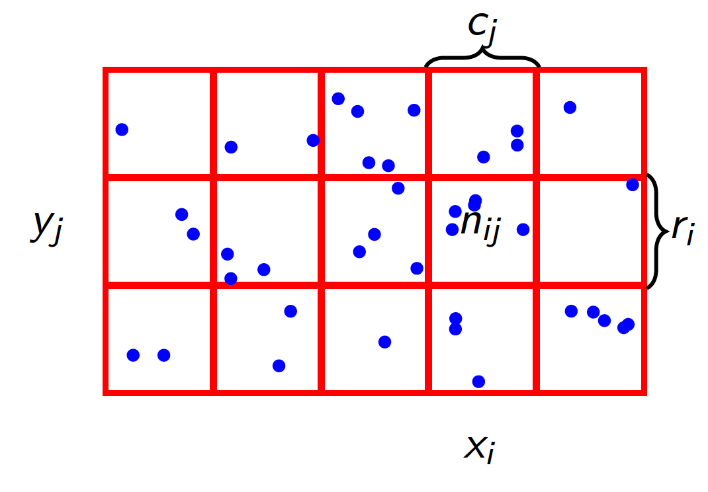
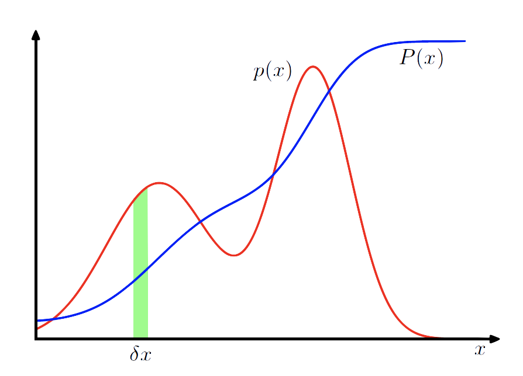

# Supplement A: Probability Theory

## Frequentist Probability

>   $p_{XY}$ is ***probability mass function*** over values that random variables $X$ and $Y$ can take.

$$
Pr(X = x_i, Y = y_j) = p_{XY}(x_i,y_j)
$$

$X$ is a random variable that can take any value $x_i$, so does $Y$ with $y_i$

If we sample $(X,Y)$ a large number of times $N$:

-   $n_{ij}$ is the number of times $X = x_i, Y = y_j$
-   $c_i$ is the number of times $X = x_i$
-   $r_j$ is the number of times $Y = y_j$

>   ***Probability mass functions*** capture the relative frequency of outcomes

## Probabilities

***Marginal Probability***:
$$
Pr(X = x_i) = p_X(x_i) = \frac{c_i}{N}
$$
***Joint Probability:***
$$
Pr(X = x_i, Y = y_j) = p_{XY}(x_i,y_j) = \frac{n_{ij}}{N}
$$
***Conditional Probability:***
$$
Pr(Y = y_j | X = x_i) = p_{Y|X}(y_j|x_i) = \frac{n_{ij}}{c_i}
$$

## Rule

***Sum Rule:***
$$
p_X(x) = \frac{c_i}{N} = \frac{1}{N}\sum_jn_{ij} = \sum_jp_{xy}(x_i,y_j)
$$

>   ***Omit subscripts for brevity:***
>   $$
>   p(x) = \sum_yp(x,y)
>   $$

***Product Rule:***
$$
p_{XY}(x_i,y_j) = \frac{n_{ij}}{N} = \frac{n_{ij}}{c_i}\times\frac{c_i}{N} = p_{Y|X}(y_j|x_i)p_{X}(x_i)
$$

>***Omit subscripts for brevity:***
>$$
>p(x,y) = p(y|x)p(x)
>$$

***Application in 3 Random Variables Case:***
$$
\begin{aligned}
p(x,y) & = \sum_zp(x,y,z)\\
p(x,y,z) &= p(x,y|z)p(z)\\
& = p(y,z|x)p(x)
\end{aligned}
$$

If $p_{XY}(x,y) = p_X(x)p_{Y}(y)$, we say $X$ and $Y$ are ***independent***

## Example: Blood Test for Disease

***Randome Variables:***

-   ***A*** disease status (***ill*** or ***healthy***)
-   ***B*** blood test (***+ve*** or ***-ve***)

$$
\begin{aligned}
p_{AB}(a,b) &= p_{A|B}(a|b)p_B(b) = p_{B|A}(b|a)p_A(a)\\
\\
p_A(ill) &= Pr(person \space has \space disease) = 1\% \\
p_B(+ve) &= Pr(person \space has \space +ve \space blood \space test) = 10\% \\
p_{B|A}(+ve | ill) &= Pr(blood \space test \space is \space +ve \space given \space person \space is \space ill ) = 70\% \\
p_{A|B}(ill | +ve) &= Pr(person \space is \space ill \space given \space blood \space test \space is \space +ve) = 7\%
\end{aligned}
$$

## Bayes Rule

$$
p(y|x) = \frac{p(x|y)p(y)}{p(x)}
$$

$p(x) = \sum_yp(x|y)p(y)$ ***normalises*** the equation

***Practically***:
$$
\begin{aligned}
p(y|x) &\propto p(x|y)p(y)\\
posterior &\propto likelihood \times prior
\end{aligned}
$$

>   ***Note that:***
>
>   The ***proportional symbol***, $\propto$, means that *when varying the parameter of interest $(y)$ in the expression on the left the only terms that vary are those on the right*. In this case, the numerator from ***Bayes Rule***, $p(x)$, does not depend on $y$ and so can be ignored. Another way to think about this is that the ***shape*** of the function $p(y|x)$ is the same as $p(x|y)p(y)$ (for fixed $x$ and varying $y$)

## Frequentist v. Bayesian

***Frequentist***

In the ***frequentist*** perspective, probability distributions represent ***expected outcomes given a large number of trails***, e.g.
$$
\mathbb{E}[X] = \lim_{N \to \infty} \frac{1}{N}\sum_n x_n
$$
***Bayesian***

***Bayesian Inference*** involves shifting the perspective in order to reason about vents that may ***happen only once***, in which ***probability is a measure of belief***

>   This is a key concept and a powerful one, We are no longer restricted to thinking about probability as measuring the relative frequencies of particular outcomes in repeatable experiments. Instead, probability is a measure of belief in, or plausibility of, an outcome

## Probability Densities

***Probability Density:***
$$
Pr(X\in(a,b)) = \int_a^bp_X(x)dx
$$
***Cumulative Distribution:***
$$
P_X(z) = Pr(X<z) = \int_{-\infty}^zp_X(x)dx
$$

>   ***Constraints:*** $p_X(x) \ge 0$ and $\int_{-\infty}^{\infty}p_X(x)dx = 1$

For vectors of continuous variables $\bold{X} = (X_1,\dots,X_k)$ then
$$
p_{\bold{X}} = p_{X_1,\dots,X_k} 
$$

## Probability Density and Bayes

The ***Sum***, ***Product*** and ***Bayes Rules*** still apply:

***Product Rule***:
$$
p(x,y) = p(y|x)p(x)
$$
***Sum Rule***:
$$
p(x) = \int p(x,y)dy
$$
***Bayes Rule***:
$$
p(x|y) = \frac{p(y|x)p(x)}{p(y)}
$$

>   ***Note that:***
>
>   Apparently, $p_X(x)$, $p(X=x)$, $p(x)$ and $p(X)$ are used ***interchangeably***. Remember $X$ is the ***random variable***, and $x$ is the ***value it takes***.

## Expectations

The average value of random variable $X$ under probability distribution $p_X(x)$ is called the expectation of $X$. 

***For discrete $X$:***
$$
\mathbb{E}[x] = \sum_x xp_X(x)
$$
***For continuous $X$:***
$$
\mathbb{E}[x] = \int xp_X(x)dx
$$
We can approximate $\mathbb{E}[x]$ with samples $\{x_i\}_{i=1}^N$ using:
$$
\mathbb{E}[x] \approx\frac{1}{N}\sum_ix_i
$$

>   ***Note that:***
>
>   When performing approximation, the probability weighting is unknown and so can no longer explicitly weigh the terms. Instead, the obersed frequency of particular values (discrete) or within particular ranges (continuous) is used as a subtitle.

## Expectations of Functions

The average value of any function of $X$, say $f(X)$, under $p_X(x)$ is called the expectation of $f$.

***For discrete $X$:***
$$
\mathbb{E}[f] = \sum_xf(X)p_X(x)
$$
***For continuous $X$:***
$$
\mathbb{E}[f] = \int f(x)p_X(x)dx
$$
We can approximate $\mathbb{E}[f(x)]$ with samples $\{x_i\}_{i=1}^N$ using:
$$
\mathbb{E}[f] \approx\frac{1}{N}\sum_i f(x_i)
$$

## Variance

The ***variance*** of $f(X)$ is a measure of its ***variability/spread***:
$$
\begin{aligned}
\mathrm{var}[f] &= \mathbb{E}[(f(x)-\mathbb{E}[f(x)])^2] \\
&= \mathbb{E}[f(x)^2] - \mathbb{E}[f(x)]^2
\end{aligned}
$$
In particular, the ***variance*** of $X$ itself (denoted $\sigma_X^2$ or $\sigma^2$) is:
$$
\mathrm{var}[X] = \mathbb{E}[X^2] - \mathbb{E}[X]^2 = \sigma_X^2
$$
***Standard deviation*** is *the square root of the variance*, typically denoted $\sigma_x$ or $\sigma$

## Covariance

***Covariance*** measures the extent to which two variables ($X$ and $Y$) vary together
$$
\mathrm{cov}[X,Y] = \mathbb{E}_{XY}[(x-\mathbb{E}[x])(y-\mathbb{E}[y])]
$$
Here $\mathbb{E}_{XY}$ indicates the *expectation over **joint distribution*** $p_{XY}$, e.g. for continuous random variables:
$$
\mathbb{E}_{XY}[f(x,y)] = \int\int f(x,y)p_{XY}(x,y)dxdy
$$
Correlation is a related measure between $-1$ and $1$:
$$
\mathrm{corr}[X,Y] = \frac{\mathrm{cov}[X,Y]}{\sigma_X\sigma_Y}
$$

## More on Expectations

When it is unclear which probability distribution is being considered for a random variable, this can be specified with a ***subscript***. E.g. ***Cross-entropy*** for discrete random variable $X$ between true distribution $p_X$ and artificial distribution $q_X$ is given by:
$$
\mathbb{E}_{x\sim p_X}[-\ln q_X(x)] = -\sum_x \ln q_X(x)p_X(x)
$$
***Conditional Expectations*** are expectations under some conditional probability distribution, $p_{X|Y}$ where $Y= y$, e.g. for continuous random variables: 
$$
\mathbb{E}[f(x)|Y=y] = \mathbb{E}_{X \sim p_{X|Y} (.|y)}[f(X)] = \int f(x) p_{X|Y}(x|y) dx
$$

>   ***Note that:***
>
>   Care should be taken with conditional probabilities and condition expectations. In the value to the right of the conditioning line is impossible then the probability distribution, and as a consequence the expectation, is ***undefined***.

