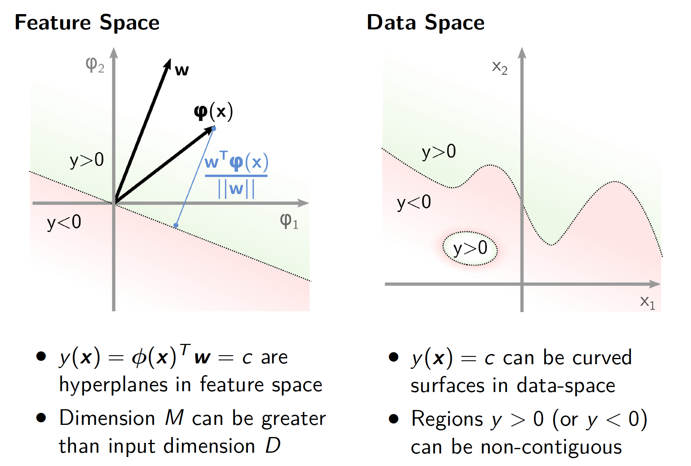
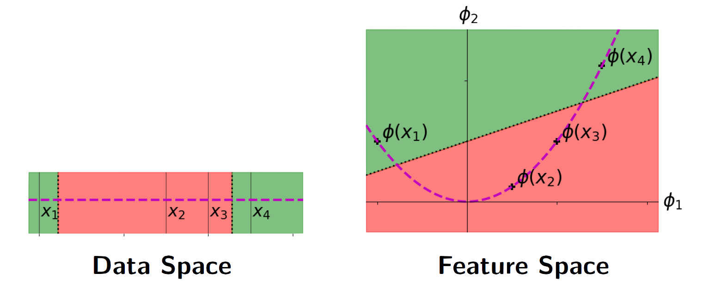
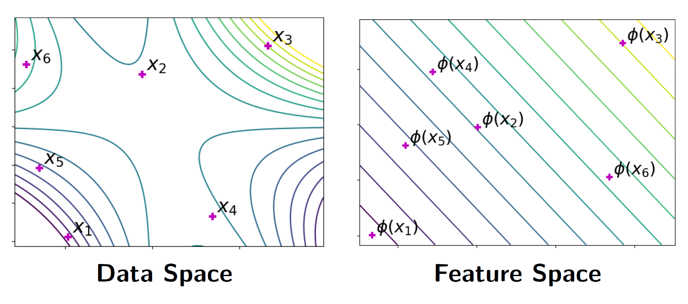
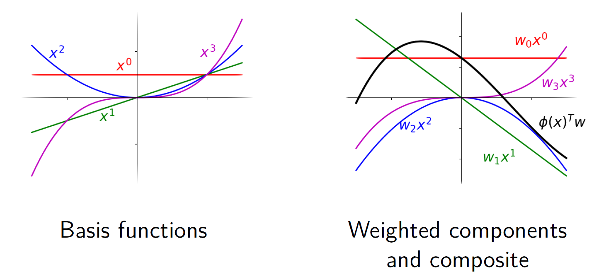
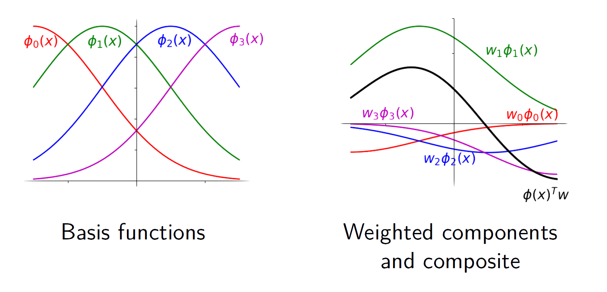

# Supplement B1: Data, Features, and Approximations

## Feature Vectors and Mappings

The ***feature vector*** for some input $\bold{x}$ is the vector
$$
\phi(\bold{x}) = (\phi_0(\bold{x}),\phi_1(\bold{x}),\dots,\phi_{M-1}(\bold{x}))^T
$$
For ***basis function*** $\phi_j:\R^D \to \R$ and typically $\phi_0(\bold{x})=1$

-   Our ***data points***, $\bold{x}_n$, are said to live in ***data space*** $(\subseteq\R^D)$
-   Equally, ***feature vectors*** live in ***feature space*** $(\subseteq\R^M)$
-   Typically $M \gt D$

The feature mapping, $\phi$, takes a data point and gives the corresponding feature vector, i.e.:
$$
\phi : \R^D \to \R^M
$$

## Linear Models and Feature Space

If you define $M$ basis functions, then your ***feature vector*** will have $M$ elements, i.e. $\phi(\bold{x})\in\R^M$.

Predictions are from linear model:
$$
y(\bold{x}) = \phi(\bold{x})^T\bold{w}
$$
and so weights are $M$-vectors $(\bold{w} \in \R^M)$

For constants $\bold{b},\bold{c} \in \R^D$, a $D-1$ dimensional plane (***hyper-plane***) is defined by:
$$
\bold{b}^T\bold{z} = \bold{c}
$$
for some $D$-dimensional vector $\bold{z}$

## Linear Models: Geometric Intuition

### Example 1: Data vs. Feature Space

A ***scalar data space*** $(x \in \R)$ and a *2-dimensional feature space* $(\phi(x) \in \R^2)$ with $\phi_1(x) = x$ and $\phi_2(x) = x^2$

>   ***$\phi_1$ axis*** in Feature Space  is the ***real axis*** in Data Space, ***$\phi_2$ axis*** in Feature Space follows a ***$x^2$ relationship***. The *purple* real line is curved  

A linear function in features defines positive region in green and negative regions in red. In data space, these regions are ***non-contiguous***

### Example 2: Data vs. Feature Space

A 2-dimensional data space $(\bold{x}\in \R^2)$ and a 2-dimensional feature space $(\phi(x)\in \R^2)$, with $\phi_1((a,b)) = a^2b$ and $\phi_2((a,b)) = ab^2$

The contours of a linear function over features are shown. In feature space, these are linear and equally spaced. In data space, the function is clearly non-linear.

## Euclidean Distance

***Radial basis function*** are defined in terms of the ***Euclidean distance*** between 2 points. Let's call these points $\bold{x},\bold{y} \in \R^D$. The Euclidean distance between $\bold{x}$ and $\bold{y}$ is then: 
$$
||\bold{x}-\bold{y}|| = \sqrt{\sum_{d=1}^D(x_d-y_d)^2}
$$
We can write the square of this in ***vector form*** as:
$$
||\bold{x}-\bold{y}||^2 = (\bold{x}-\bold{y})^T(\bold{x}-\bold{y})
$$

## Radial Basis Functions

For vector inputs, $\bold{x}_n \in \R^D$, a ***Radial Basis Function***, $\phi_j$, needs a centre $\mathbf{\mu}_j \in \R^D$ and s scale $s \in \R$, giving: 
$$
\phi_j(\bold{x}) = \exp (-\frac{||\bold{x} - \mathbf{\mu}_j||^2}{2s^2})
$$
Commonly, the same scale, $s$, is shared across all basis functions. This has similarities with the ***Multivariate Normal Distribution*** with ***isotropic covariance***.

>   $\phi_j(\bold{x})$ is closer to $1$ as the data points are closer to centre and is closer to 0 as the data points are furthur away from the centre. 

## Monomial Basis Function

A ***linear model*** with *monomial basis functions* is ***a weighted mixture of monomial components.*** Below on the left are the raw basis functions, and on the right are ***weighted components*** (coloured) and the ***composite function*** (black).

## RBF Basis Functions

A linear model with ***radial basis functions*** (RBFs) is a ***weighted mixture of RBF components***. Below on the left are the raw basis functions, and on the right are ***weighted components*** (coloured) and the ***composite function*** (black).

>   ***Note that:***
>
>   We can consider all of the composite functions (black) that we can construct from our weighted components as a ***function space***, which is a set of functions available to us that we can fit to our data.

